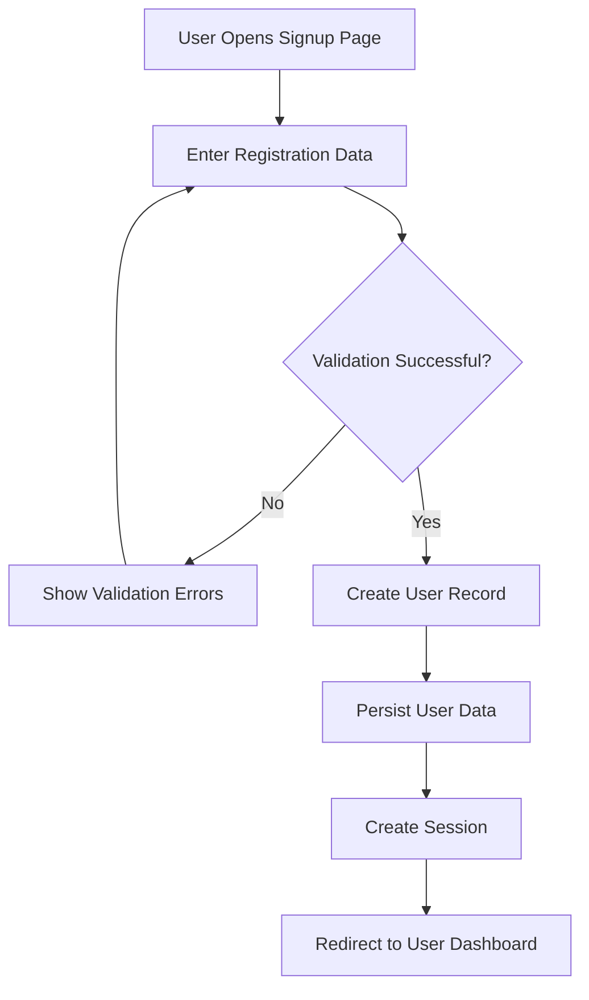
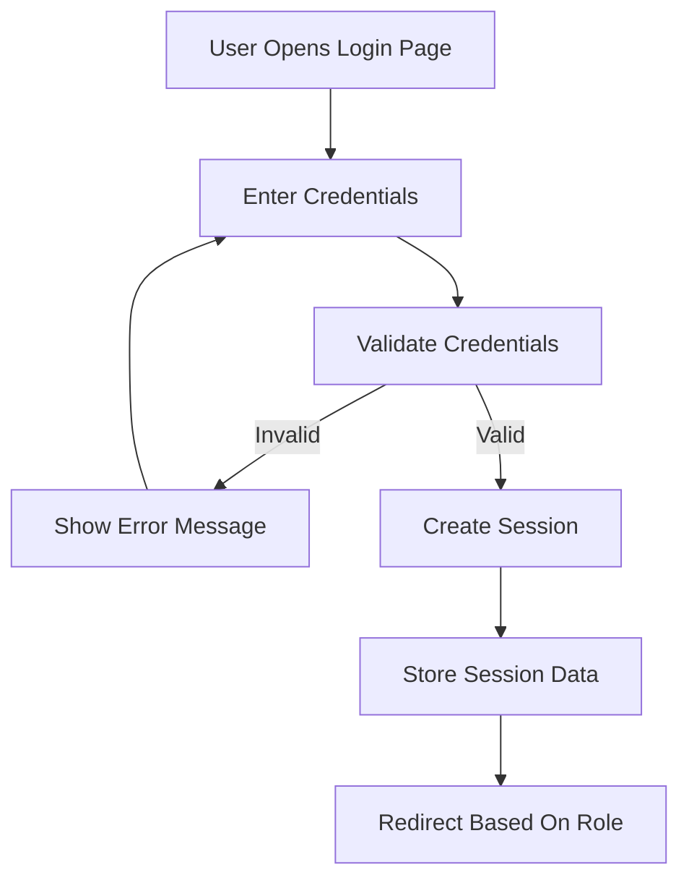
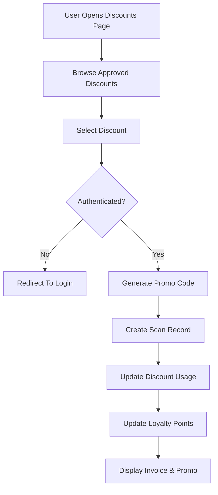
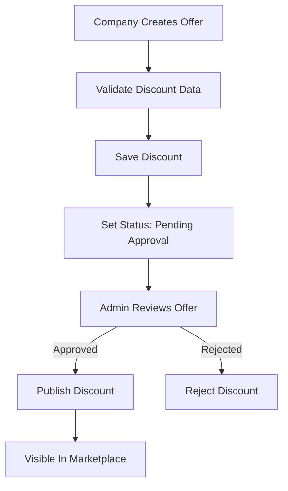
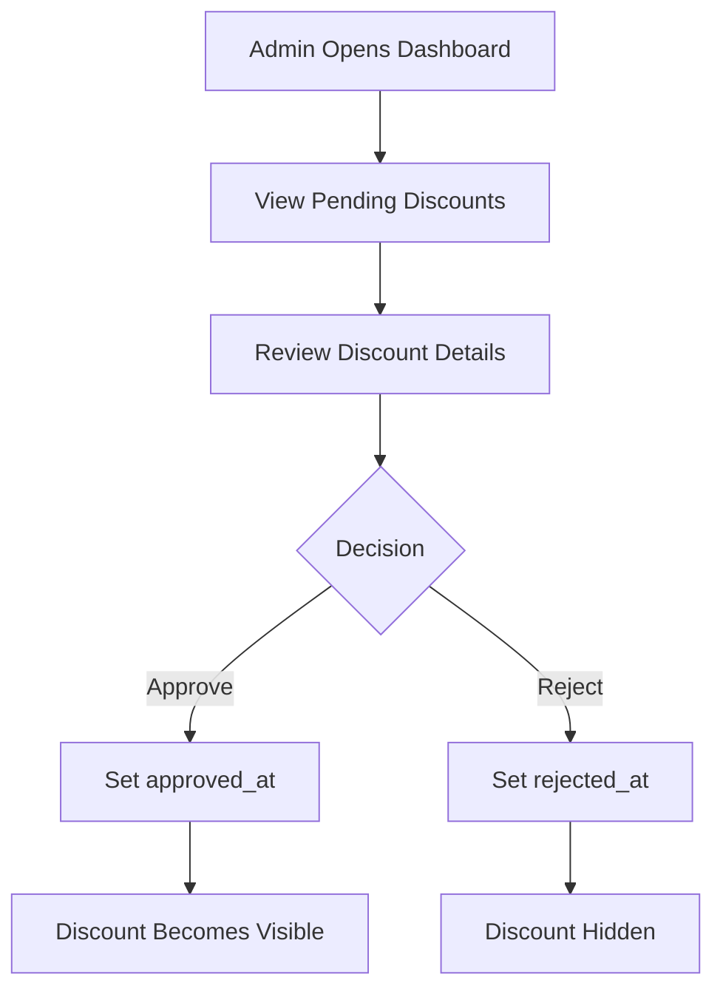
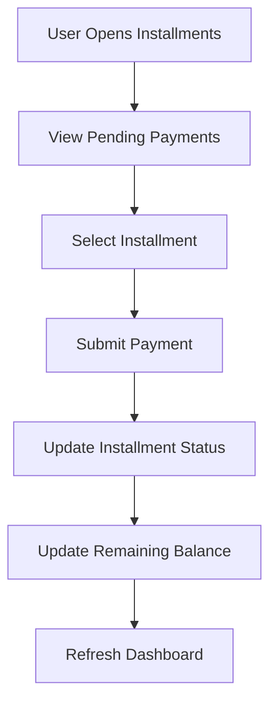
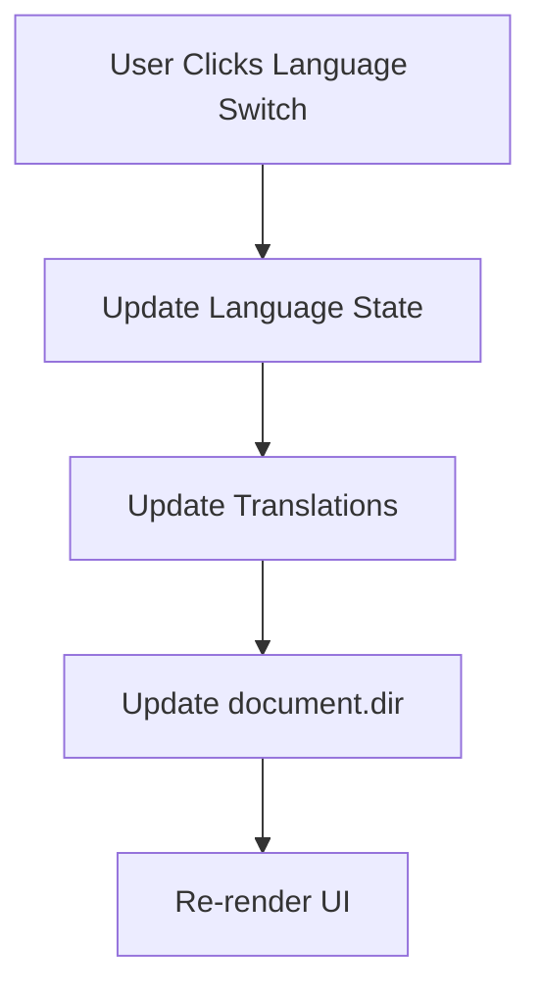
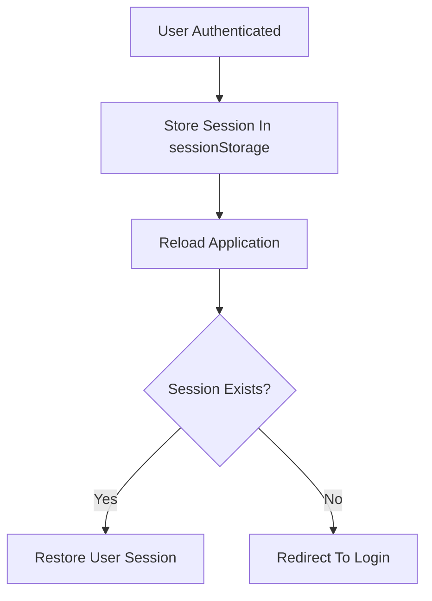

# Business Process Flows

## Project Name

Mustakleen Platform

---

# 1. Introduction

This document defines the major business process workflows within the Mustakleen platform.

The flows represent the interactions between:

* users
* companies
* administrators
* platform services

These workflows support:

* business understanding
* architecture tracing
* QA planning
* end-to-end testing
* system analysis

---

# 2. User Registration Flow

---

# 3. User Login Flow

---

# 4. Discount Redemption Flow

---

# 5. Company Discount Publishing Flow

---

# 6. Admin Approval Workflow

---

# 7. Installment Payment Flow

---

# 8. Localization Flow

---

# 9. Session Management Flow

---

# 10. Business Flow Dependencies

| Flow                | Depends On                          |
| ------------------- | ----------------------------------- |
| Registration        | Validation + Persistence            |
| Login               | Authentication + Session Storage    |
| Discount Redemption | Approved Discounts + Authentication |
| Installments        | Payment Tracking                    |
| Admin Approval      | Authorization                       |
| Localization        | Language Context                    |
| Analytics           | Scan Records                        |

---

# 11. Risks Within Business Flows

| Flow                | Potential Risk            |
| ------------------- | ------------------------- |
| Login               | Session corruption        |
| Signup              | Duplicate accounts        |
| Discount Redemption | Invalid discount state    |
| Installments        | Incorrect balances        |
| Localization        | Inconsistent UI direction |
| Admin Approval      | Unauthorized access       |

---

# 12. QA Impact

These process flows support:

* end-to-end testing
* business flow validation
* regression testing
* sequence tracing
* exploratory testing
* automation planning

---

# 13. Conclusion

The business process flows define the operational lifecycle of the platform and provide the foundation for:

* architecture understanding
* QA design
* future scalability
* production readiness
