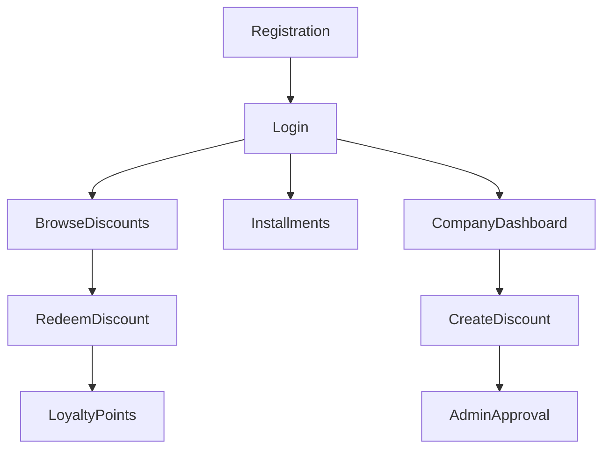

# Use Cases

## Project Name

Mustakleen Platform

---

# 1. Introduction

This document defines the primary use cases for the Mustakleen platform.

Use cases describe:

* actor interactions
* system workflows
* expected outcomes
* business behavior

These use cases support:

* QA testing
* business analysis
* requirement validation
* user journey analysis
* future automation planning

---

# 2. Actors

| Actor                  | Description                                      |
| ---------------------- | ------------------------------------------------ |
| End User               | Uses the platform to browse and redeem discounts |
| Company Representative | Publishes and manages discounts                  |
| Administrator          | Moderates and manages platform operations        |

---

# 3. Use Case Overview

| Use Case ID | Use Case            |
| ----------- | ------------------- |
| UC-001      | User Registration   |
| UC-002      | User Login          |
| UC-003      | Browse Discounts    |
| UC-004      | Redeem Discount     |
| UC-005      | Manage Installments |
| UC-006      | Create Discount     |
| UC-007      | Approve Discount    |
| UC-008      | View Analytics      |
| UC-009      | Switch Language     |
| UC-010      | Logout              |

---

# 4. Use Cases

---

# UC-001 — User Registration

## Primary Actor

End User

## Preconditions

* User is not authenticated.
* Signup page is accessible.

## Main Flow

1. User opens signup page.
2. User enters registration information.
3. System validates inputs.
4. System creates user record.
5. System persists user data.
6. System creates authenticated session.
7. User is redirected to dashboard.

## Alternative Flows

* Duplicate email detected.
* Validation failure occurs.

## Postconditions

* User account exists.
* Session is active.

---

# UC-002 — User Login

## Primary Actor

End User

## Preconditions

* User account exists.

## Main Flow

1. User opens login page.
2. User enters credentials.
3. System validates credentials.
4. Session initializes successfully.
5. User redirects to role dashboard.

## Alternative Flows

* Invalid credentials.
* Corrupted session state.

## Postconditions

* User becomes authenticated.

---

# UC-003 — Browse Discounts

## Primary Actor

End User

## Preconditions

* Approved discounts exist.

## Main Flow

1. User opens discounts page.
2. System loads approved discounts.
3. User searches or filters discounts.
4. Matching results display dynamically.

## Alternative Flows

* No discounts found.
* Empty state appears.

## Postconditions

* Discounts display successfully.

---

# UC-004 — Redeem Discount

## Primary Actor

End User

## Preconditions

* User is authenticated.
* Discount is approved.

## Main Flow

1. User selects a discount.
2. User clicks redeem.
3. System validates authorization.
4. System generates promo code.
5. System creates invoice.
6. System records redemption.
7. System updates loyalty points.
8. User receives redemption confirmation.

## Alternative Flows

* User not authenticated.
* Invalid discount state.
* Redemption failure.

## Postconditions

* Redemption persists successfully.

---

# UC-005 — Manage Installments

## Primary Actor

End User

## Preconditions

* Installments exist.

## Main Flow

1. User opens installments page.
2. System loads installment schedule.
3. User marks installment as paid.
4. System updates balances.
5. Dashboard refreshes.

## Alternative Flows

* Invalid installment state.
* Payment inconsistency.

## Postconditions

* Installment status updates successfully.

---

# UC-006 — Create Discount

## Primary Actor

Company Representative

## Preconditions

* Company user is authenticated.

## Main Flow

1. Company opens dashboard.
2. Company creates new discount.
3. System validates discount data.
4. System stores offer.
5. Discount enters pending approval state.

## Alternative Flows

* Validation failure.
* Missing required data.

## Postconditions

* Discount persists successfully.

---

# UC-007 — Approve Discount

## Primary Actor

Administrator

## Preconditions

* Pending discounts exist.

## Main Flow

1. Admin opens moderation dashboard.
2. Admin reviews pending discounts.
3. Admin approves or rejects offer.
4. System updates discount state.

## Alternative Flows

* Unauthorized access attempt.
* Invalid discount state.

## Postconditions

* Discount moderation completes successfully.

---

# UC-008 — View Analytics

## Primary Actor

Company Representative

## Preconditions

* Analytics data exists.

## Main Flow

1. Company opens analytics dashboard.
2. System loads redemption statistics.
3. Dashboard displays usage metrics.

## Alternative Flows

* Missing analytics data.
* Rendering issues.

## Postconditions

* Analytics display successfully.

---

# UC-009 — Switch Language

## Primary Actor

Any User

## Preconditions

* Multiple languages exist.

## Main Flow

1. User clicks language switch.
2. System updates translation state.
3. System updates document direction.
4. UI re-renders successfully.

## Alternative Flows

* Missing translation keys.

## Postconditions

* Language changes successfully.

---

# UC-010 — Logout

## Primary Actor

Authenticated User

## Preconditions

* User is authenticated.

## Main Flow

1. User clicks logout.
2. System clears session data.
3. Protected routes become inaccessible.
4. User redirects to login page.

## Alternative Flows

* Corrupted session data.

## Postconditions

* User session ends successfully.

---

# 5. Use Case Relationships

---

# 6. Risks Associated With Use Cases

| Use Case       | Risk                      |
| -------------- | ------------------------- |
| Login          | Session corruption        |
| Registration   | Duplicate accounts        |
| Redemption     | Data inconsistency        |
| Installments   | Incorrect balances        |
| Admin Approval | Unauthorized moderation   |
| Localization   | Rendering inconsistencies |

---

# 7. QA Impact

These use cases support:

* end-to-end testing
* regression testing
* exploratory testing
* user journey validation
* automation planning

---

# 8. Conclusion

The use cases define the expected interactions between users and the Mustakleen platform.

They provide the operational foundation for:

* QA planning
* business validation
* requirement traceability
* future release preparation
