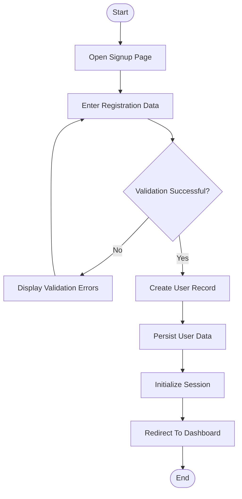
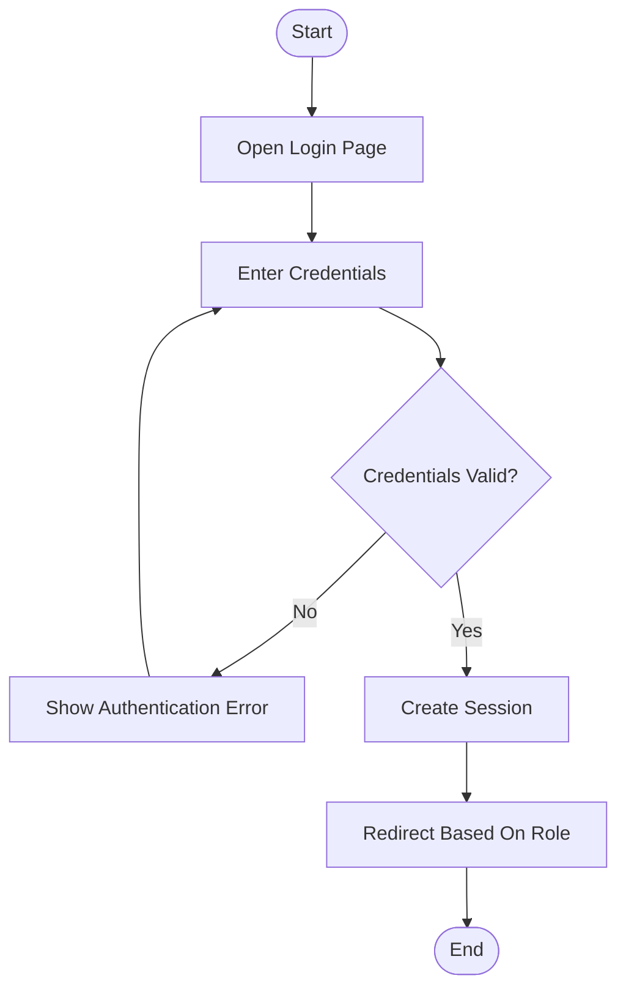
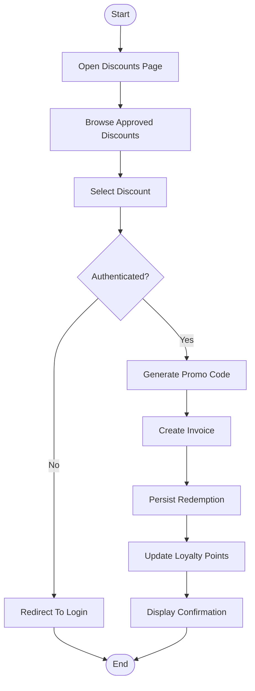
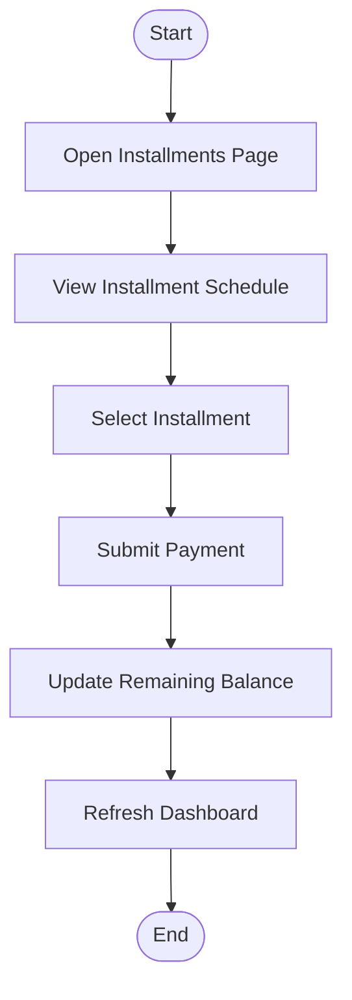
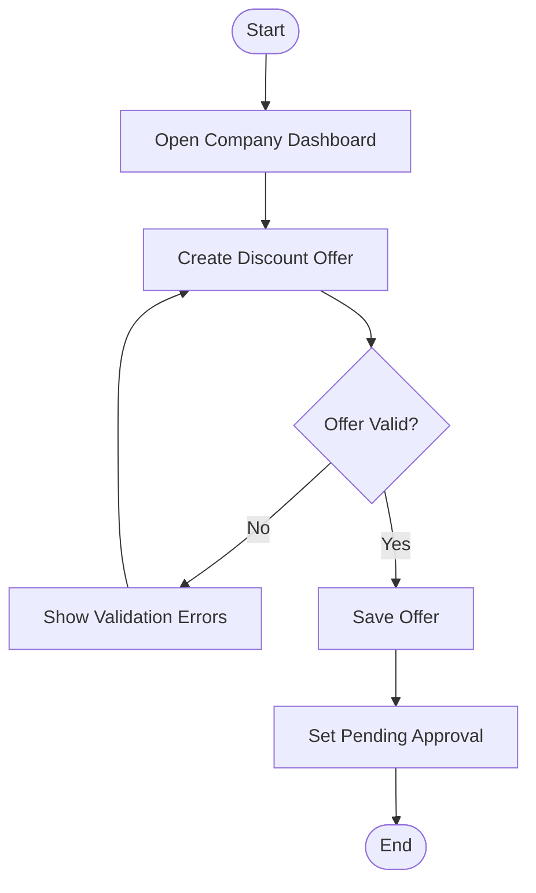
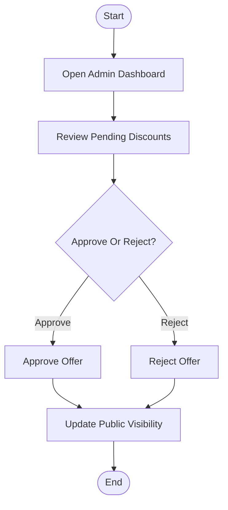
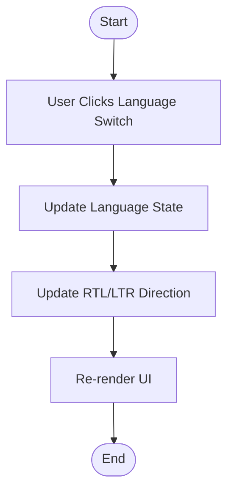
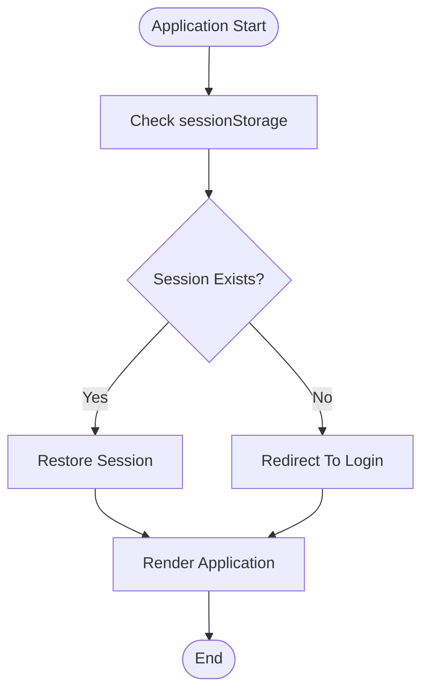

# Activity Diagrams

## Project Name

Mustakleen Platform

---

# 1. Introduction

This document defines the primary activity diagrams within the Mustakleen platform.

Activity diagrams describe:

* business workflows
* decision paths
* operational flow logic
* process transitions
* user/system interactions

These diagrams support:

* business analysis
* QA planning
* exploratory testing
* UAT validation
* workflow tracing

---

# 2. User Registration Activity

---

# 3. User Login Activity

---

# 4. Discount Redemption Activity

---

# 5. Installment Payment Activity

---

# 6. Company Offer Creation Activity

---

# 7. Admin Moderation Activity

---

# 8. Language Switching Activity

---

# 9. Session Restoration Activity

---

# 10. Workflow Risks

| Workflow     | Risk                      |
| ------------ | ------------------------- |
| Registration | Duplicate accounts        |
| Login        | Corrupted session         |
| Redemption   | Invalid discount state    |
| Installments | Incorrect balances        |
| Moderation   | Unauthorized approvals    |
| Localization | Rendering inconsistencies |

---

# 11. QA Impact

These activity diagrams support:

* end-to-end testing
* business workflow validation
* regression testing
* exploratory testing
* user journey analysis
* automation planning

---

# 12. Conclusion

The activity diagrams define the operational workflows of the Mustakleen platform and provide:

* business process visibility
* workflow tracing
* QA preparation
* system behavior understanding
