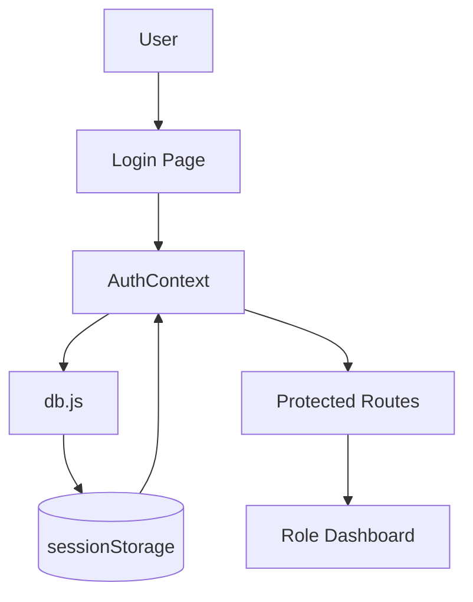
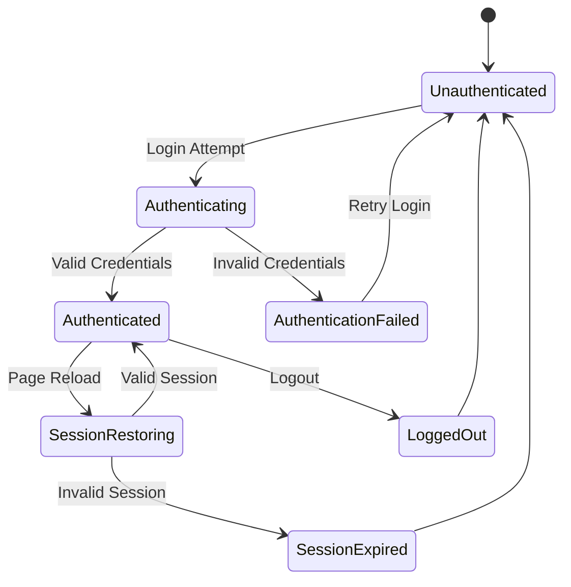
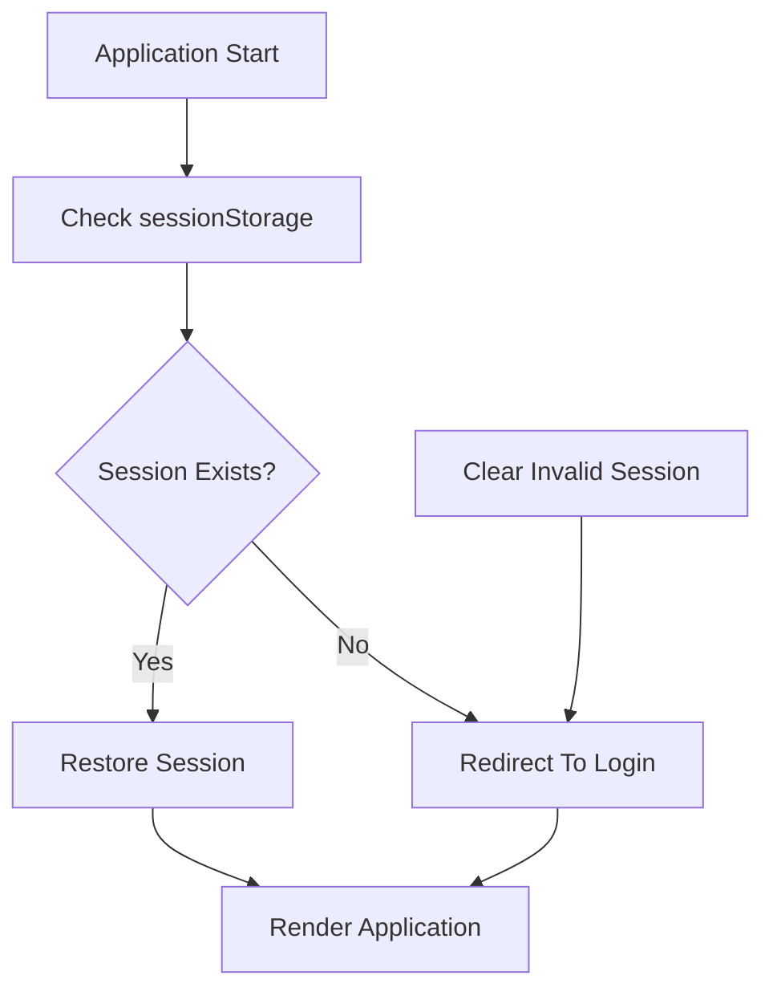
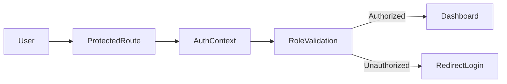

# Authentication State Flow

## Project Name

Mustakleen Platform

---

# 1. Introduction

This document defines the authentication lifecycle and session state flow within the Mustakleen platform.

The purpose is to describe:

* authentication behavior
* session lifecycle
* authorization transitions
* protected route validation
* session restoration flow

This document supports:

* QA testing
* security analysis
* debugging
* automation planning
* state validation

---

# 2. Authentication Architecture Overview

The platform currently uses:

* client-side authentication
* sessionStorage persistence
* role-based routing
* Context API state management

---

# 3. Authentication Lifecycle Overview

---

# 4. Authentication State Diagram

---

# 5. Login Flow

## Main Steps

1. User opens login page.
2. User enters credentials.
3. AuthContext validates credentials through db.js.
4. Session data stores in sessionStorage.
5. Role-based dashboard renders.
6. Protected routes become accessible.

---

# 6. Logout Flow

## Main Steps

1. User clicks logout.
2. Session clears from sessionStorage.
3. AuthContext resets authentication state.
4. Protected routes become inaccessible.
5. User redirects to login page.

---

# 7. Session Restoration Flow

---

# 8. Protected Route Flow

---

# 9. Role-Based Authorization

| Role     | Accessible Areas             |
| -------- | ---------------------------- |
| End User | User Dashboard, Discounts    |
| Company  | Company Dashboard, Analytics |
| Admin    | Admin Dashboard, Moderation  |

---

# 10. Session Persistence Strategy

| Storage        | Purpose                  |
| -------------- | ------------------------ |
| sessionStorage | Active session state     |
| localStorage   | Persistent business data |

---

# 11. Authentication Risks

| Risk                       | Severity |
| -------------------------- | -------- |
| Client-side authentication | Critical |
| Session tampering          | High     |
| Missing backend validation | Critical |
| Corrupted session data     | High     |
| Unauthorized route bypass  | High     |

---

# 12. Error Scenarios

| Scenario            | Expected Behavior          |
| ------------------- | -------------------------- |
| Invalid credentials | Show authentication error  |
| Missing session     | Redirect to login          |
| Corrupted session   | Clear session and redirect |
| Unauthorized role   | Block route access         |

---

# 13. QA Validation Areas

QA should validate:

* login success/failure
* session persistence
* logout behavior
* role-based authorization
* protected route access
* session corruption handling
* unauthorized access attempts

---

# 14. Recommended Improvements

* Add backend authentication
* Add JWT/session validation
* Add token expiration handling
* Add centralized authentication logging
* Add refresh token support

---

# 15. Future Scalability Considerations

Future authentication improvements may include:

* OAuth integration
* server-side sessions
* JWT authentication
* MFA support
* RBAC expansion

---

# 16. Conclusion

The authentication flow defines the lifecycle and state transitions of authenticated users within the Mustakleen platform.

It provides visibility into:

* session management
* role-based authorization
* protected route behavior
* authentication risks
* QA validation requirements
