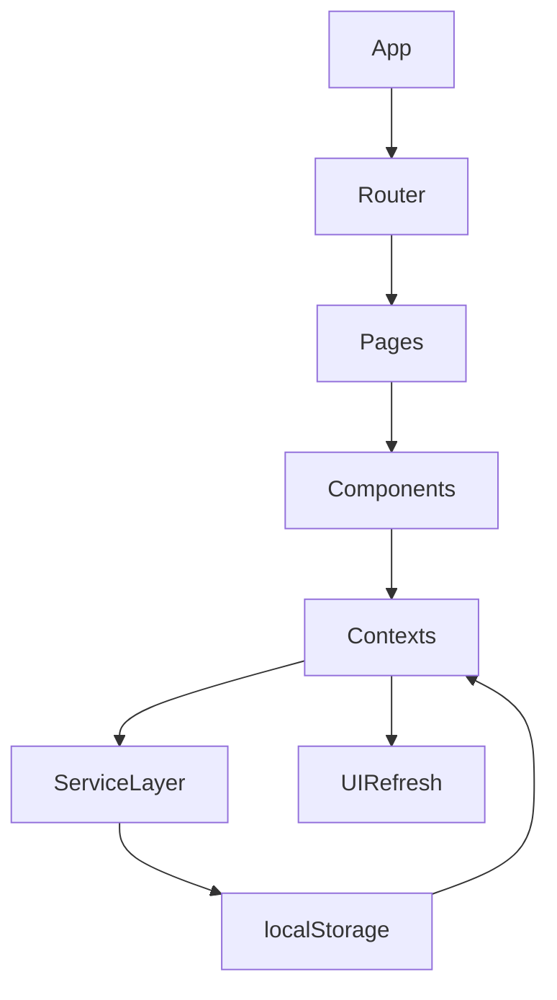
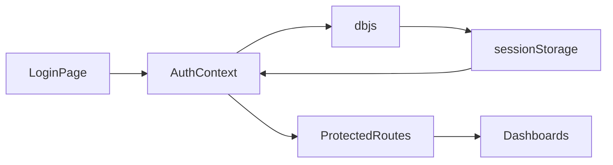
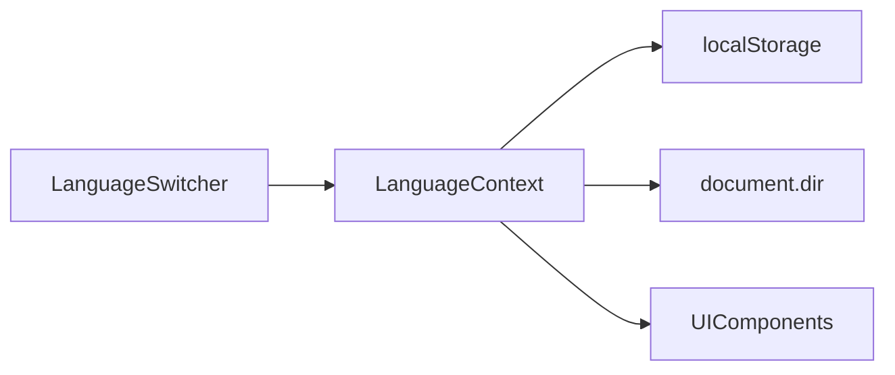
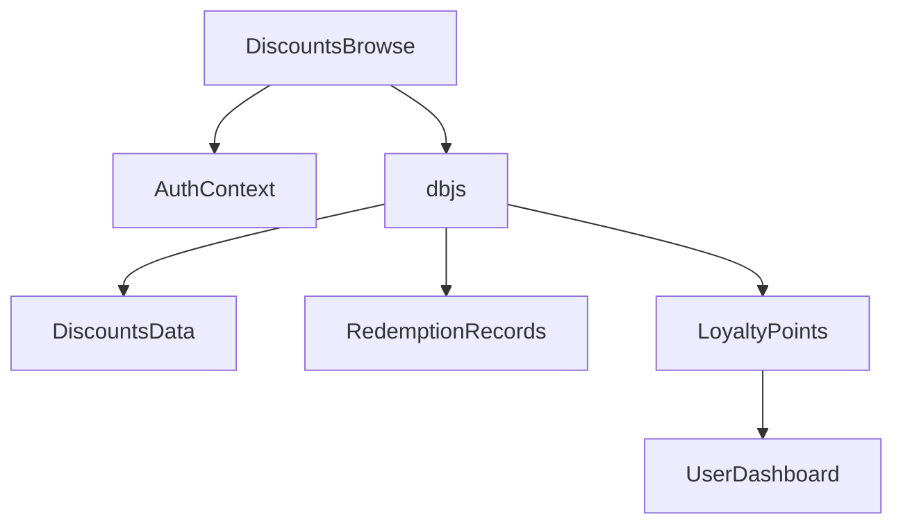
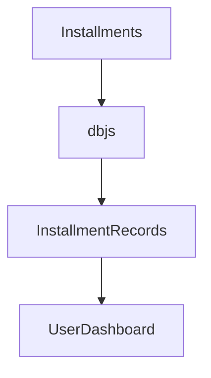
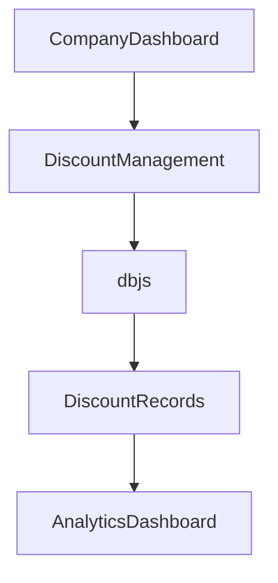
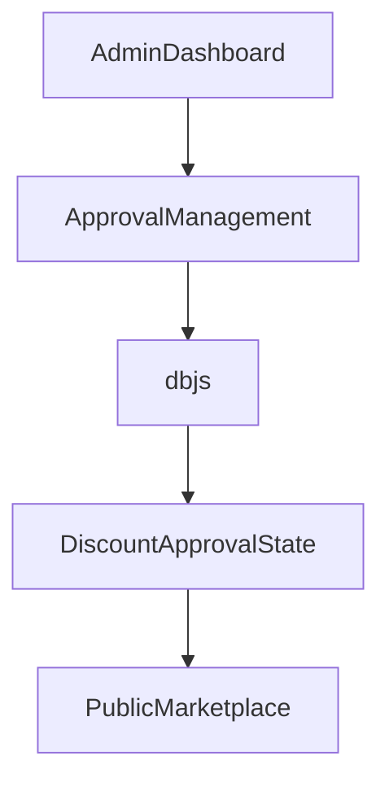
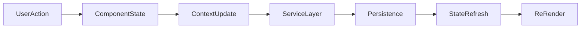
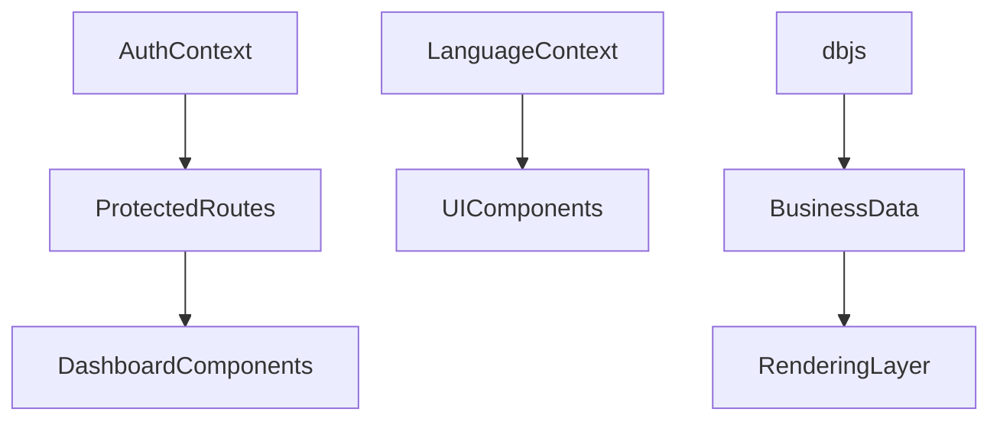
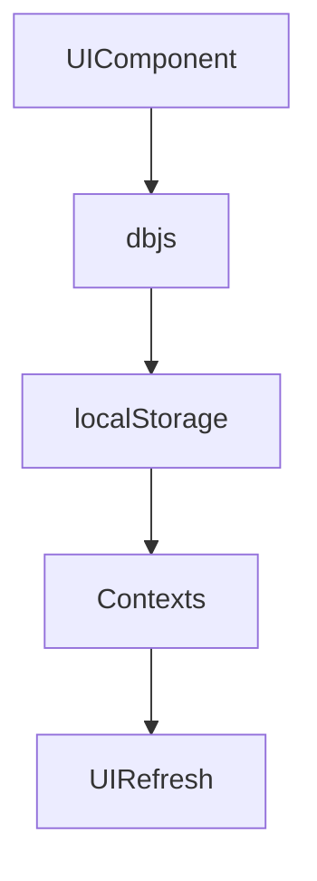

# Component Communication Diagrams

## Project Name

Mustakleen Platform

---

# 1. Introduction

This document defines the communication relationships between frontend components, contexts, services, and persistence layers within the Mustakleen platform.

The diagrams describe:

* component interactions
* state propagation
* service communication
* rendering dependencies
* persistence synchronization

These diagrams support:

* debugging
* QA tracing
* automation planning
* maintainability analysis
* frontend architecture understanding

---

# 2. Application Communication Overview

---

# 3. Authentication Communication Flow

---

# 4. Localization Communication Flow

---

# 5. Discount Redemption Communication Flow

---

# 6. Installment Communication Flow

---

# 7. Company Dashboard Communication Flow

---

# 8. Admin Moderation Communication Flow

---

# 9. State Propagation Flow

---

# 10. UI Rendering Dependency Flow

---

# 11. Persistence Synchronization Flow

---

# 12. Communication Risks

| Area                    | Risk                    |
| ----------------------- | ----------------------- |
| Shared state updates    | UI inconsistency        |
| Centralized db.js       | Tight coupling          |
| Missing synchronization | Stale rendering         |
| localStorage dependency | Persistence instability |
| Context over-rendering  | Performance degradation |

---

# 13. QA Impact

These communication diagrams support:

* UI state tracing
* automation stability analysis
* debugging
* rendering validation
* regression testing
* state synchronization testing

---

# 14. Recommended Improvements

* Add service modularization
* Add centralized event logging
* Reduce shared state coupling
* Add test-friendly selectors
* Improve rendering isolation

---

# 15. Conclusion

The communication diagrams define how components, contexts, services, and persistence layers interact within the Mustakleen platform.

They provide visibility into:

* rendering dependencies
* state synchronization
* storage communication
* frontend execution flow
* architectural risks
