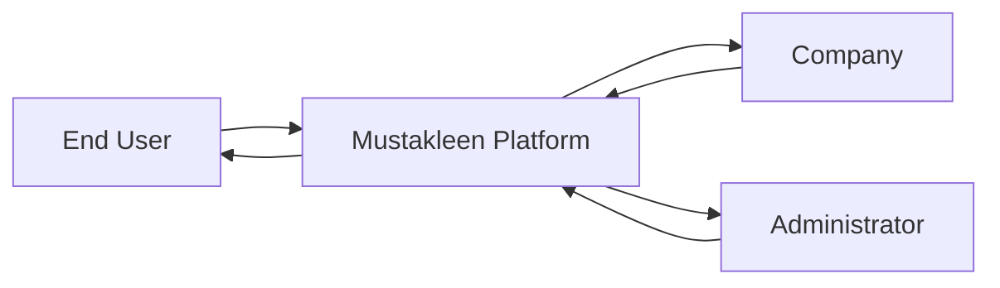
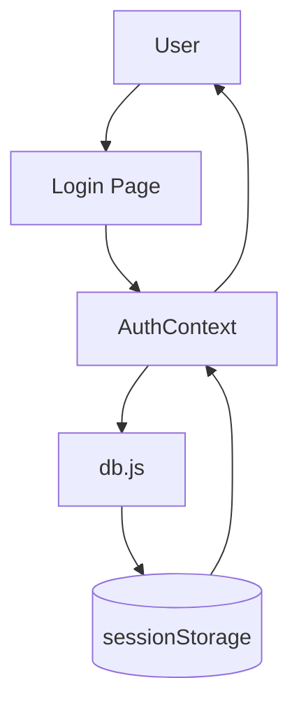
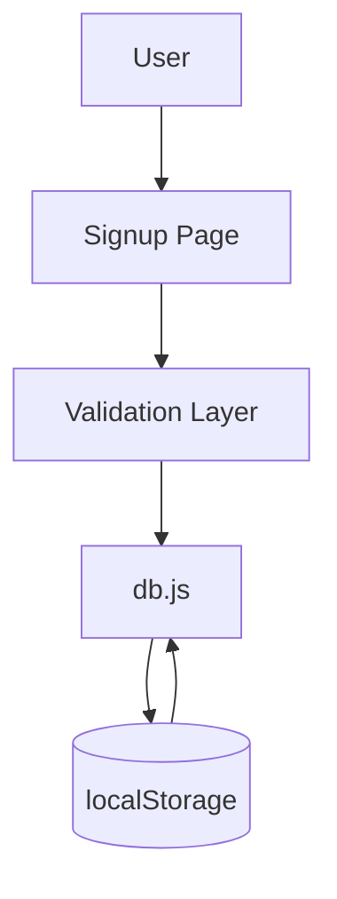
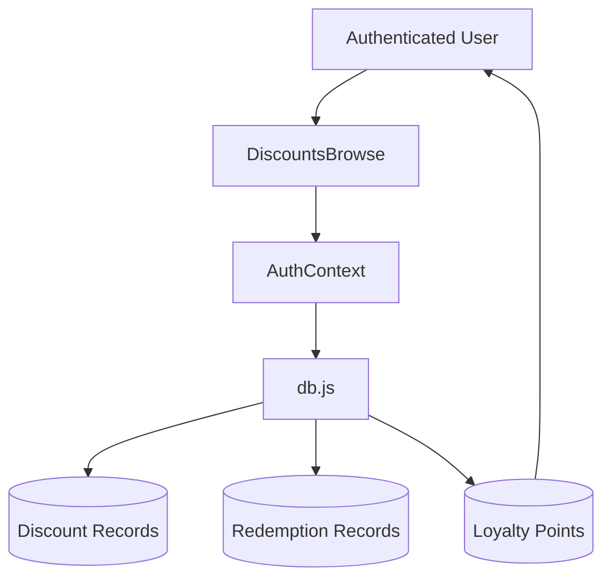
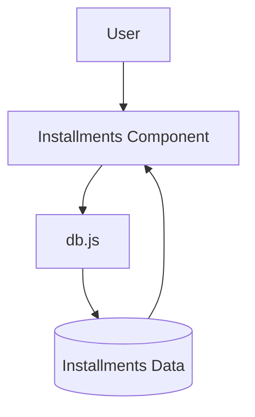
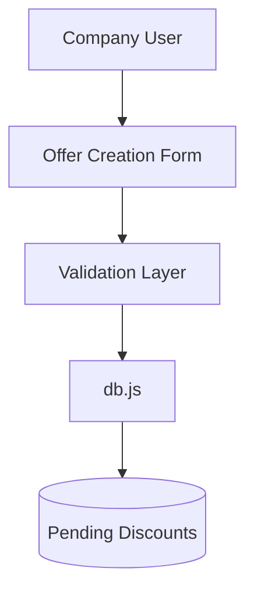
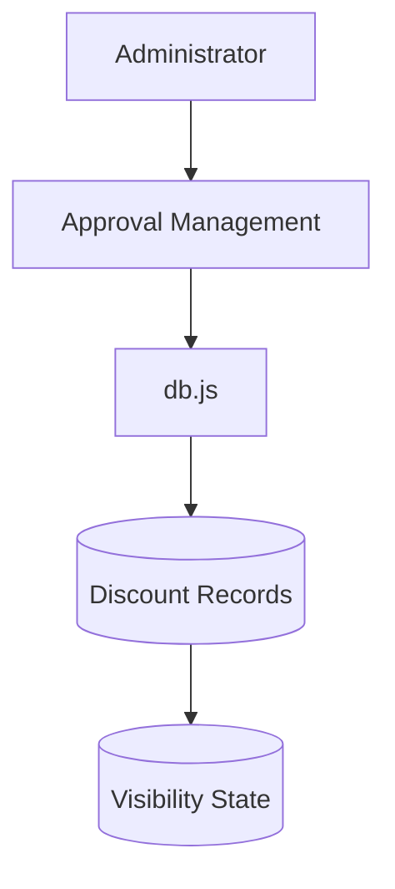
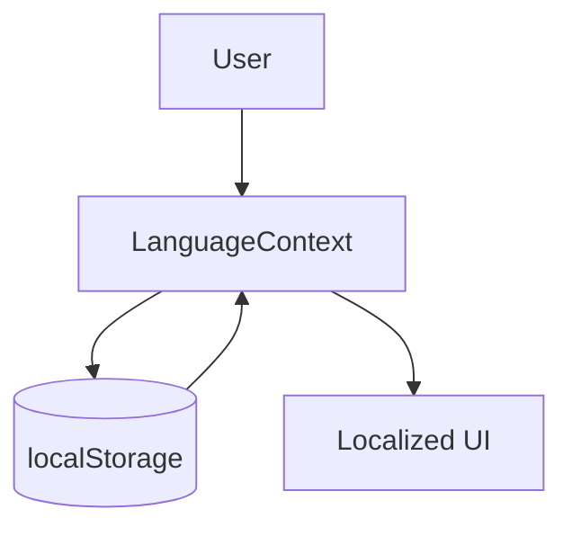
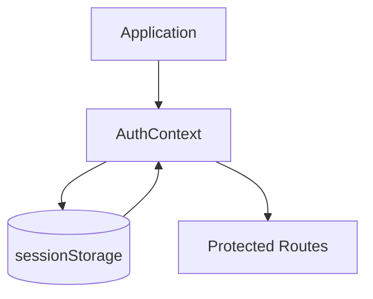

# Data Flow Diagrams (DFD)

## Project Name

Mustakleen Platform

---

# 1. Introduction

This document defines the Data Flow Diagrams (DFDs) for the Mustakleen platform.

DFDs describe:

* how data moves through the system
* where data is stored
* how components interact with persistence
* how business operations update application state

These diagrams support:

* architecture understanding
* QA tracing
* debugging
* persistence validation
* future backend migration planning

---

# 2. System Context Diagram (Level 0)

---

# 3. Authentication Data Flow

---

# 4. Registration Data Flow

---

# 5. Discount Redemption Data Flow

---

# 6. Installment Data Flow

---

# 7. Company Offer Creation Flow

---

# 8. Admin Moderation Flow

---

# 9. Localization Data Flow

---

# 10. Session Restoration Flow

---

# 11. Data Persistence Overview

| Data Type      | Storage Mechanism |
| -------------- | ----------------- |
| Users          | localStorage      |
| Discounts      | localStorage      |
| Sessions       | sessionStorage    |
| Loyalty Points | localStorage      |
| Installments   | localStorage      |
| Localization   | localStorage      |

---

# 12. Data Flow Risks

| Risk                          | Impact                    |
| ----------------------------- | ------------------------- |
| Corrupted storage             | Invalid application state |
| Manual localStorage tampering | Security inconsistencies  |
| Missing synchronization       | Stale UI                  |
| Shared mutations              | Data inconsistency        |
| Missing backend validation    | Invalid persistence       |

---

# 13. QA Impact

These DFDs support:

* persistence testing
* session testing
* state validation
* debugging
* regression analysis
* integration understanding

---

# 14. Future Improvements

Recommended future architecture improvements:

* backend APIs
* centralized database
* secure authentication
* server-side persistence
* audit logging
* monitoring systems

---

# 15. Conclusion

The DFDs define how information moves across the Mustakleen platform.

They provide visibility into:

* storage operations
* business data handling
* authentication persistence
* workflow state updates
* component/service interactions
