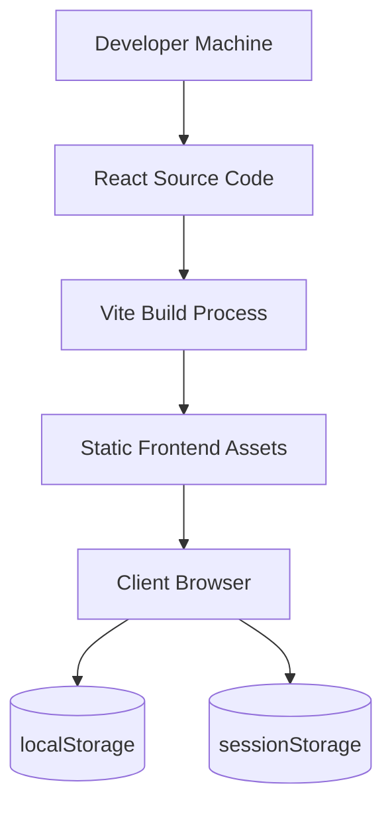
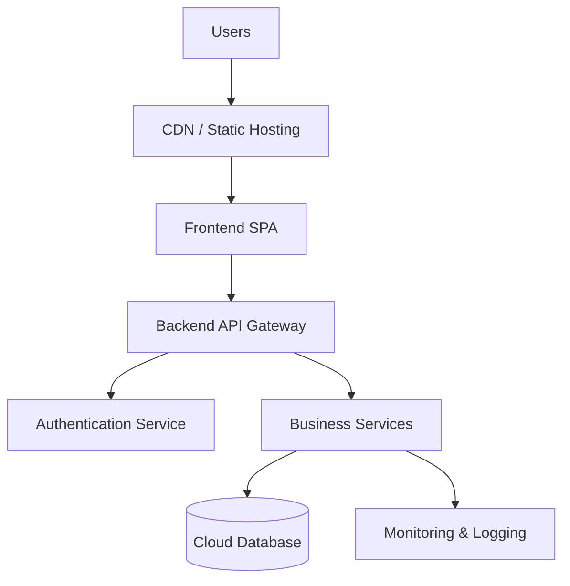

# Deployment Architecture

## Project Name

Mustakleen Platform

---

# 1. Introduction

This document defines the deployment architecture and runtime assumptions for the Mustakleen platform.

The purpose is to describe:

* deployment structure
* runtime environment
* build process
* hosting assumptions
* scalability considerations
* operational constraints

This document supports:

* production readiness analysis
* DevOps planning
* QA environment preparation
* future scalability planning

---

# 2. Current Deployment Model

The current platform architecture is:

* frontend-only
* static SPA deployment
* browser-executed application
* client-side persistence model

---

# 3. Current Deployment Topology

---

# 4. Runtime Environment

| Area             | Environment                 |
| ---------------- | --------------------------- |
| Frontend Runtime | Browser                     |
| Build Tool       | Vite                        |
| Styling Engine   | Tailwind CSS                |
| Animation Engine | Framer Motion               |
| State Management | React Context API           |
| Persistence      | localStorage/sessionStorage |

---

# 5. Build Process

## Main Steps

1. Source code is written using React + Vite.
2. Vite bundles frontend assets.
3. Static assets are generated.
4. Browser loads SPA bundle.
5. Runtime state initializes through contexts.

---

# 6. Deployment Assumptions

| Assumption             | Description                      |
| ---------------------- | -------------------------------- |
| Modern Browser Support | ES6-compatible browsers required |
| JavaScript Enabled     | Required for SPA execution       |
| localStorage Enabled   | Required for persistence         |
| sessionStorage Enabled | Required for authentication      |

---

# 7. Static Hosting Model

The platform can be deployed using:

* Netlify
* Vercel
* GitHub Pages
* Firebase Hosting
* Traditional static hosting

---

# 8. Current Architectural Limitations

| Limitation                 | Impact              |
| -------------------------- | ------------------- |
| No backend APIs            | Limited scalability |
| Client-side authentication | Security risks      |
| Browser-only persistence   | Limited reliability |
| No server database         | No centralized data |
| No observability tooling   | Difficult debugging |

---

# 9. Future Deployment Vision

Future production architecture may include:

* backend APIs
* database servers
* authentication services
* cloud deployment
* monitoring systems
* CI/CD pipelines

---

# 10. Future Scalable Deployment Diagram

---

# 11. CI/CD Vision

Future CI/CD pipeline may include:

* GitHub Actions
* automated linting
* automated testing
* build validation
* deployment automation

---

# 12. QA Environment Considerations

| Area             | QA Impact                           |
| ---------------- | ----------------------------------- |
| Browser storage  | Persistence testing required        |
| SPA routing      | Route validation required           |
| Client-side auth | Security validation required        |
| Static hosting   | Refresh routing validation required |

---

# 13. Deployment Risks

| Risk                       | Severity |
| -------------------------- | -------- |
| localStorage dependency    | High     |
| Missing backend validation | Critical |
| Client-side authentication | Critical |
| Missing telemetry          | High     |
| Browser storage corruption | High     |

---

# 14. Recommended Improvements

* Add backend infrastructure
* Add secure authentication service
* Add centralized database
* Add telemetry & monitoring
* Add CI/CD automation
* Add environment configuration management

---

# 15. Production Readiness Gaps

Current production gaps include:

* no backend APIs
* no centralized persistence
* no monitoring
* no security hardening
* no server-side validation

---

# 16. Conclusion

The current deployment architecture provides a lightweight frontend-only SPA deployment model suitable for:

* development
* demos
* graduation project delivery

Future scalability requires:

* backend integration
* secure authentication
* centralized infrastructure
* production-grade observability
* deployment automation
