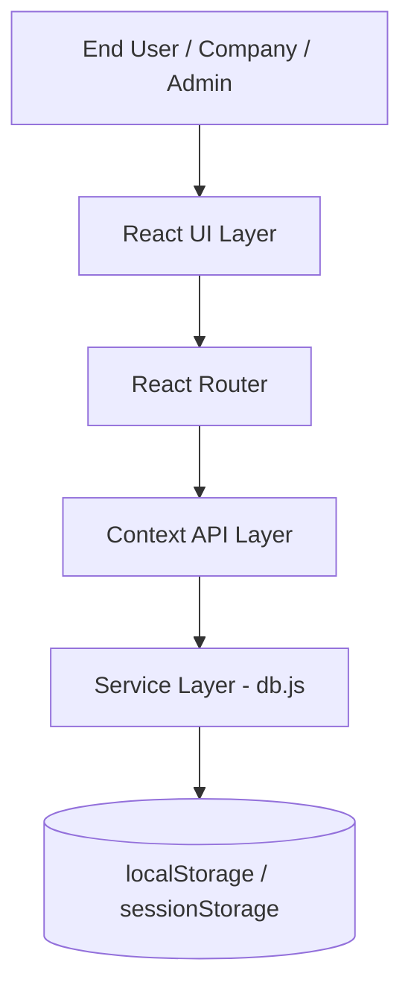
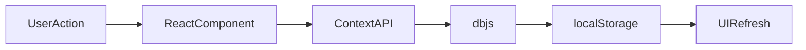

# High-Level Architecture

## Project Name

Mustakleen Platform

---

# 1. Introduction

This document defines the high-level architecture of the Mustakleen platform.

The purpose is to provide a simplified architectural overview of:

* major system layers
* core interactions
* data flow
* primary responsibilities

This document supports:

* onboarding
* architectural understanding
* QA preparation
* future scalability planning

---

# 2. System Overview

Mustakleen is a:

* frontend-only
* React-based
* Single Page Application (SPA)

The architecture consists of:

* presentation layer
* state management layer
* service layer
* persistence layer

---

# 3. High-Level System Diagram



---

# 4. Architectural Layers

---

## 4.1 Presentation Layer

### Responsibilities

* Render UI
* Capture user interactions
* Display dashboards and forms
* Handle navigation

### Main Technologies

* React
* Tailwind CSS
* Framer Motion

---

## 4.2 Routing Layer

### Responsibilities

* Manage SPA navigation
* Handle protected routes
* Support role-based access

### Main Technologies

* React Router

---

## 4.3 State Management Layer

### Responsibilities

* Manage authentication state
* Manage localization state
* Synchronize UI updates

### Main Technologies

* React Context API

---

## 4.4 Service Layer

### Responsibilities

* CRUD operations
* Data persistence
* Business calculations
* Analytics processing

### Main File

```text id="k9q8w4"
db.js
```

---

## 4.5 Persistence Layer

### Responsibilities

* Persist user data
* Persist discounts
* Persist sessions
* Restore application state

### Main Technologies

* localStorage
* sessionStorage

---

# 5. Main User Flows

| Flow                | Description                      |
| ------------------- | -------------------------------- |
| Authentication Flow | Login/logout/session restoration |
| Discount Flow       | Browse/redeem discounts          |
| Installment Flow    | Track and update installments    |
| Moderation Flow     | Admin approval workflows         |
| Localization Flow   | Language switching               |

---

# 6. Role-Based Architecture

| Role     | Main Responsibilities        |
| -------- | ---------------------------- |
| End User | Browse and redeem discounts  |
| Company  | Manage offers and analytics  |
| Admin    | Moderate platform operations |

---

# 7. Data Flow Overview



---

# 8. Architectural Characteristics

| Characteristic          | Description                  |
| ----------------------- | ---------------------------- |
| Frontend-only           | No backend APIs currently    |
| Client-side persistence | Uses browser storage         |
| Modular UI              | Component-based architecture |
| SPA navigation          | No full page reloads         |
| Role-based access       | Protected routing            |

---

# 9. Architectural Risks

| Risk                       | Impact              |
| -------------------------- | ------------------- |
| Client-side authentication | Security exposure   |
| Centralized db.js          | Scalability risk    |
| localStorage limitations   | Data inconsistency  |
| Missing observability      | Difficult debugging |

---

# 10. Scalability Vision

Future improvements may include:

* backend APIs
* cloud deployment
* server-side authentication
* database integration
* monitoring systems
* CI/CD pipelines

---

# 11. QA Impact

The architecture affects:

* testability
* automation stability
* state validation
* session testing
* role-based testing
* UI state management

---

# 12. Conclusion

The high-level architecture provides a simplified view of the Mustakleen platform structure and interactions.

It establishes the foundation for:

* deeper technical analysis
* QA planning
* scalability preparation
* future system evolution
