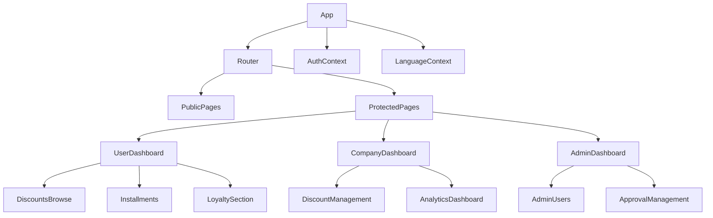
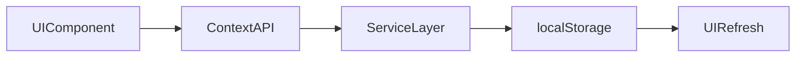
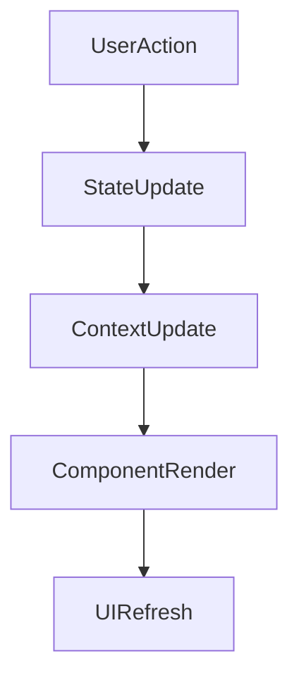

# Low-Level Component Architecture

## Project Name

Mustakleen Platform

---

# 1. Introduction

This document defines the low-level component architecture of the Mustakleen platform.

The purpose is to explain:

* React component hierarchy
* component responsibilities
* component communication
* state dependencies
* routing interactions
* rendering responsibilities

This document supports:

* frontend maintainability
* QA understanding
* debugging
* automation planning
* scalability preparation

---

# 2. Frontend Component Structure

The frontend architecture follows:

* reusable component design
* page-based organization
* context-driven state management
* modular UI separation

---

# 3. Component Hierarchy Overview

---

# 4. Core Application Components

---

## 4.1 App Component

### Responsibilities

* Initialize application
* Register routes
* Wrap global providers
* Initialize contexts

### Dependencies

* React Router
* AuthContext
* LanguageContext

---

## 4.2 Router Layer

### Responsibilities

* Route navigation
* Protected route handling
* Role-based access

### Main Features

* Public routes
* Authenticated routes
* Admin-only routes
* Company-only routes

---

## 4.3 AuthContext

### Responsibilities

* Store authenticated user
* Restore sessions
* Handle login/logout
* Protect routes

### Dependencies

* sessionStorage
* db.js

### Risks

* Corrupted sessions
* Unauthorized state restoration

---

## 4.4 LanguageContext

### Responsibilities

* Manage current language
* Control RTL/LTR rendering
* Persist selected language

### Dependencies

* localStorage
* Translation dictionaries

---

# 5. Dashboard Components

---

## 5.1 UserDashboard

### Responsibilities

* Display user information
* Show loyalty points
* Display installment status
* Provide discount access

### Child Components

* DiscountsBrowse
* Installments
* LoyaltySection

---

## 5.2 CompanyDashboard

### Responsibilities

* Manage offers
* Display analytics
* Track engagement

### Child Components

* DiscountManagement
* AnalyticsDashboard

---

## 5.3 AdminDashboard

### Responsibilities

* Moderate discounts
* Manage users
* Control approvals

### Child Components

* AdminUsers
* ApprovalManagement

---

# 6. Feature Components

---

## 6.1 DiscountsBrowse

### Responsibilities

* Load approved discounts
* Filter/search offers
* Trigger redemption workflows

### State Dependencies

* AuthContext
* Discount filters
* Search state

### Risks

* Stale rendering
* Invalid filtering state
* Unauthorized redemption attempts

---

## 6.2 Installments

### Responsibilities

* Display installment schedules
* Update payment status
* Refresh balances

### Risks

* Incorrect calculations
* State synchronization issues

---

## 6.3 DiscountManagement

### Responsibilities

* Create discounts
* Edit discounts
* Submit approval requests

### Risks

* Invalid validation handling
* Broken approval state

---

## 6.4 ApprovalManagement

### Responsibilities

* Approve offers
* Reject offers
* Update moderation state

### Risks

* Unauthorized actions
* Inconsistent visibility states

---

# 7. Component Communication Model

---

# 8. State Dependency Mapping

| Component        | Main Dependencies  |
| ---------------- | ------------------ |
| App              | Router, Contexts   |
| AuthContext      | sessionStorage     |
| LanguageContext  | localStorage       |
| DiscountsBrowse  | AuthContext, db.js |
| UserDashboard    | User state         |
| CompanyDashboard | Discount analytics |
| AdminDashboard   | Moderation state   |

---

# 9. Rendering Flow

---

# 10. Architectural Risks

| Risk                     | Impact                 |
| ------------------------ | ---------------------- |
| Tight coupling to db.js  | Maintainability risk   |
| Shared state mutations   | UI inconsistency       |
| Missing ErrorBoundary    | Full render failures   |
| Dynamic rendering states | Automation instability |

---

# 11. QA Impact

The component architecture affects:

* UI testing
* state validation
* rendering stability
* automation reliability
* exploratory testing
* regression coverage

---

# 12. Recommended Improvements

* Add ErrorBoundary
* Add stable data-testid selectors
* Improve service modularization
* Reduce centralized dependencies
* Add logging utilities

---

# 13. Conclusion

The low-level architecture defines the detailed structure and responsibilities of the frontend components within the Mustakleen platform.

It provides the technical foundation for:

* frontend maintainability
* QA planning
* debugging
* automation design
* future scalability
