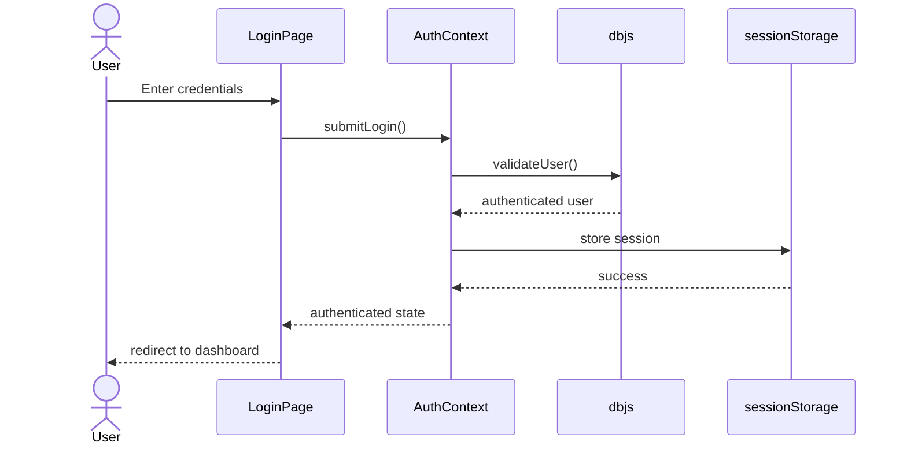
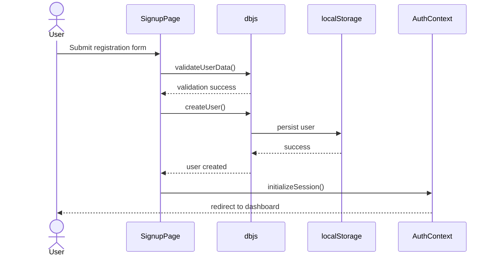
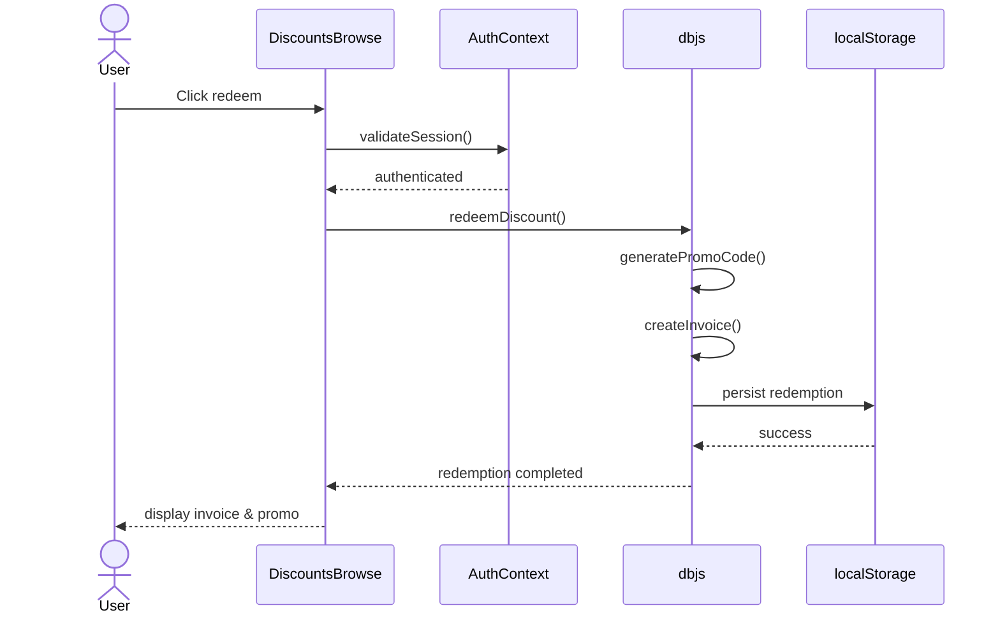
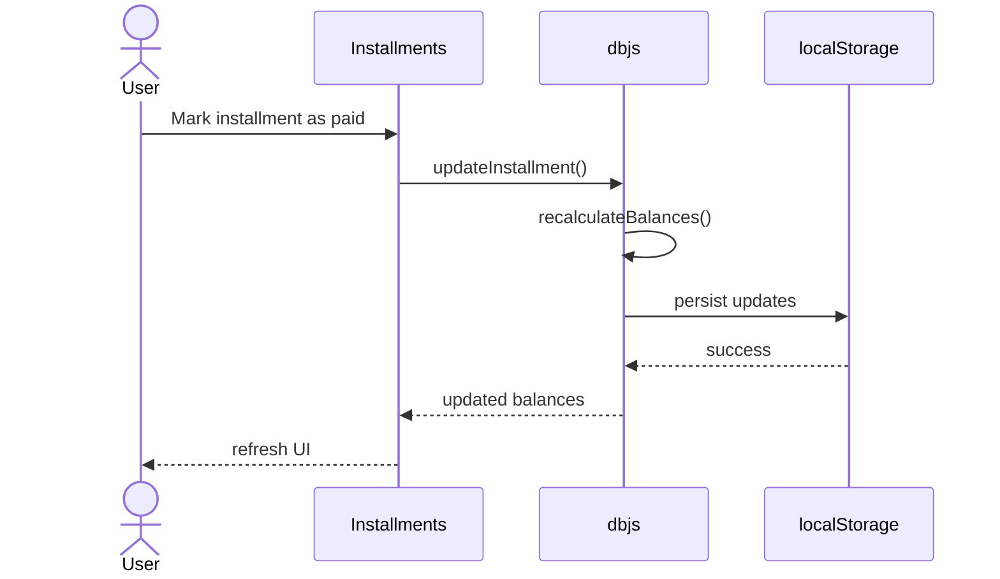
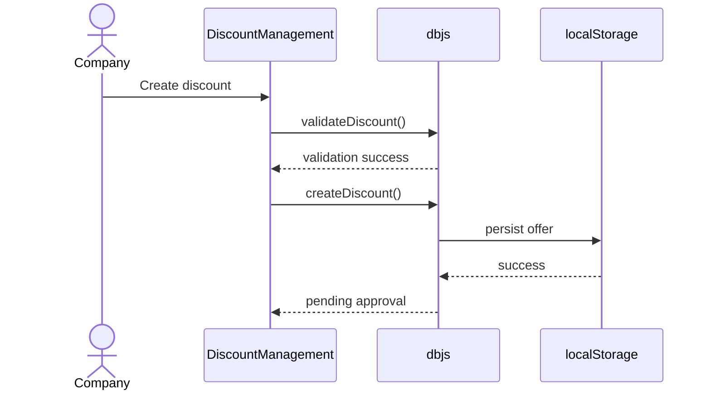
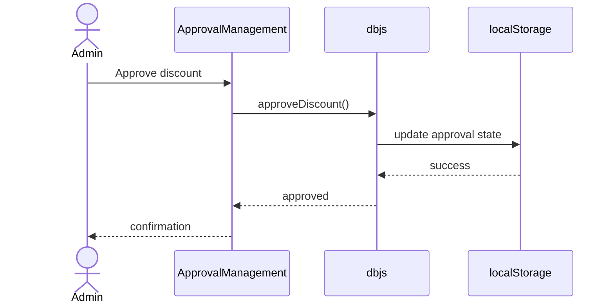
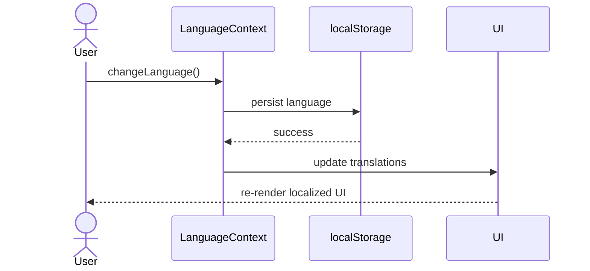
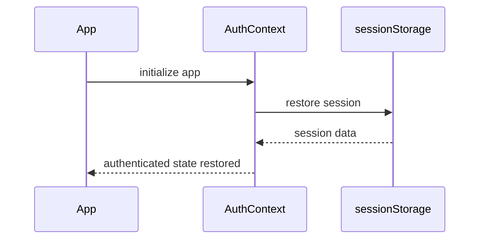

# Sequence Diagrams

## Project Name

Mustakleen Platform

---

# 1. Introduction

This document defines the primary sequence diagrams within the Mustakleen platform.

Sequence diagrams describe:

* execution flow
* component interaction order
* service communication
* state updates
* persistence operations

These diagrams support:

* QA tracing
* debugging
* automation understanding
* architectural analysis
* business flow validation

---

# 2. User Login Sequence

---

# 3. User Registration Sequence

---

# 4. Discount Redemption Sequence

---

# 5. Installment Payment Sequence

---

# 6. Company Discount Creation Sequence

---

# 7. Admin Approval Sequence

---

# 8. Language Switching Sequence

---

# 9. Session Restoration Sequence

---

# 10. Sequence Flow Risks

| Flow           | Risk                         |
| -------------- | ---------------------------- |
| Login          | Corrupted session            |
| Registration   | Duplicate accounts           |
| Redemption     | Inconsistent persistence     |
| Installments   | Invalid balance updates      |
| Admin Approval | Unauthorized moderation      |
| Localization   | State synchronization issues |

---

# 11. QA Impact

These sequence diagrams support:

* end-to-end tracing
* QA test design
* automation planning
* debugging
* regression analysis
* state validation

---

# 12. Conclusion

The sequence diagrams define the operational execution flow of the Mustakleen platform.

They provide detailed insight into:

* interaction order
* state changes
* persistence operations
* user workflows
* component communication
