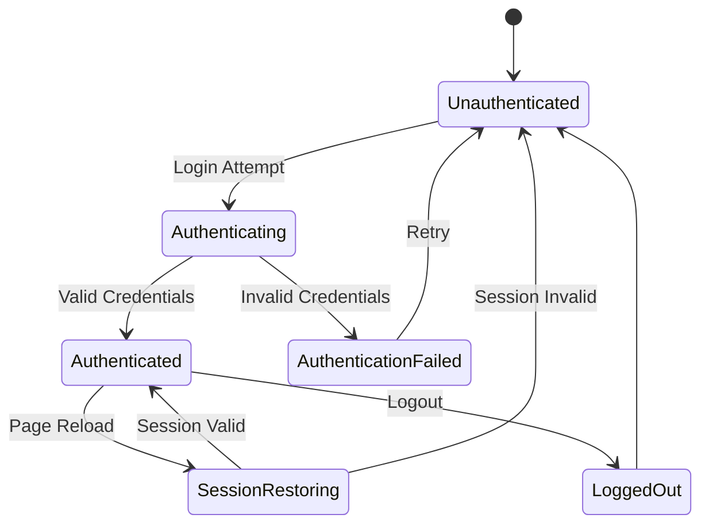
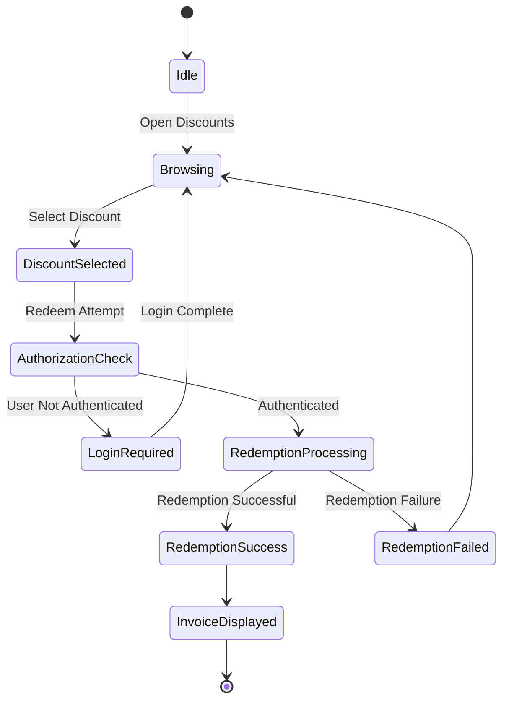
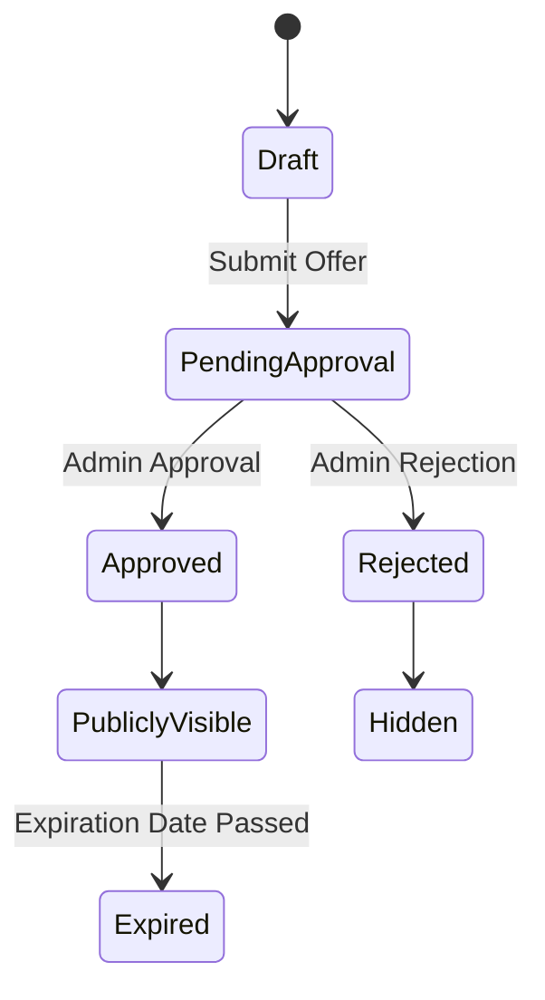
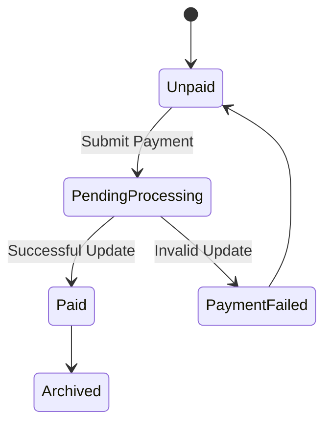
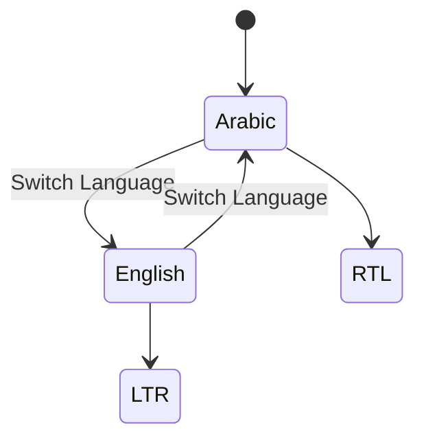
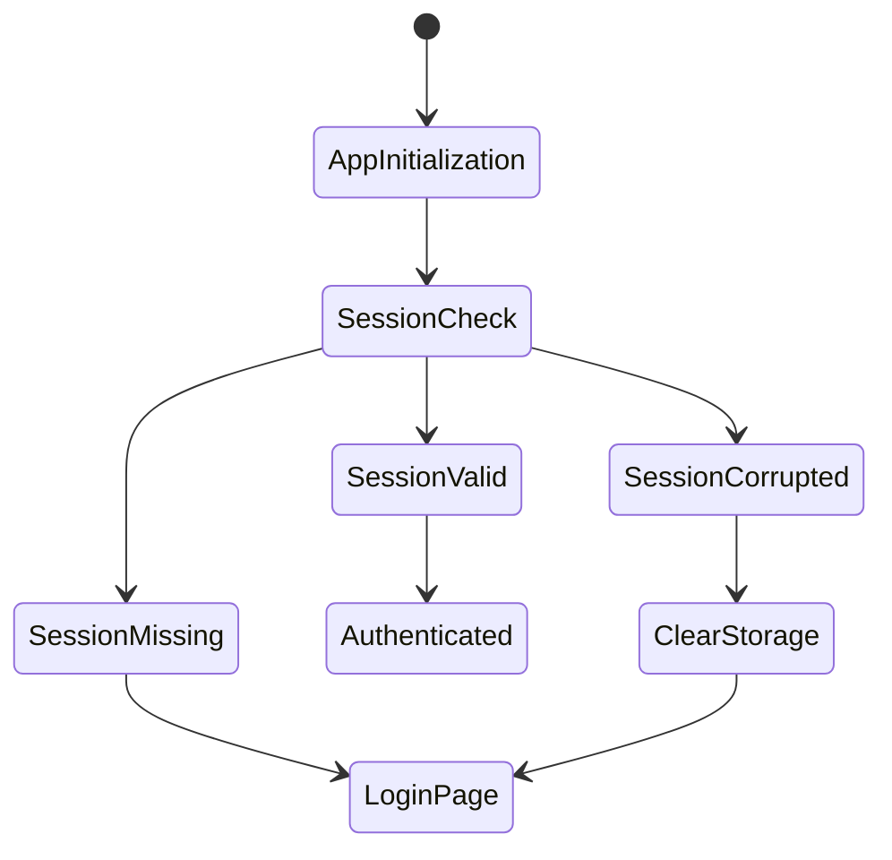
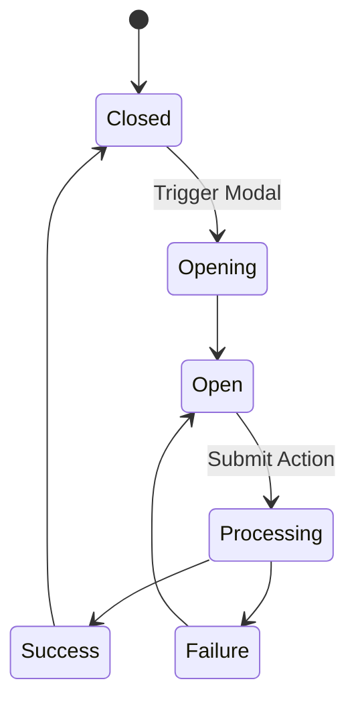
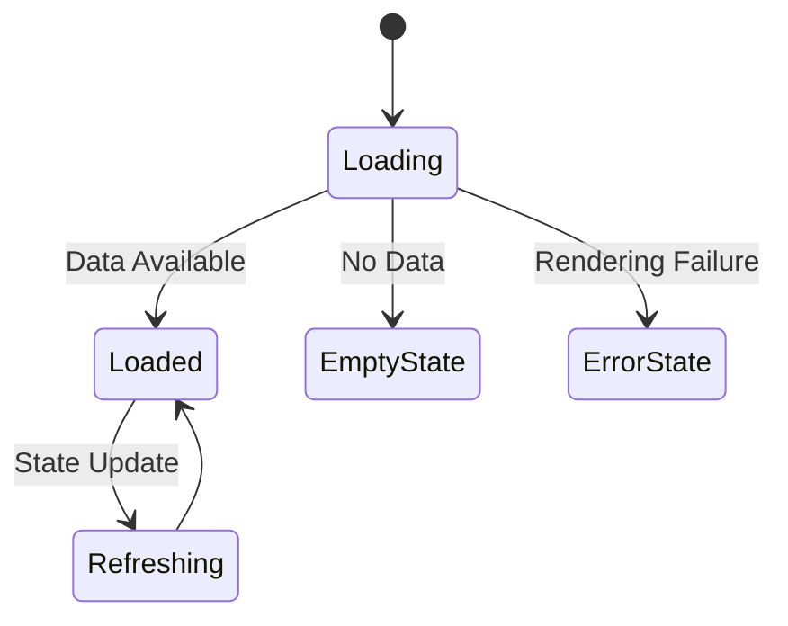

# State Transition Diagrams

## Project Name

Mustakleen Platform

---

# 1. Introduction

This document defines the primary state transition diagrams within the Mustakleen platform.

State transition diagrams describe:

* UI states
* authentication states
* business state changes
* moderation states
* rendering transitions
* workflow progression

These diagrams support:

* QA testing
* state validation
* automation stability
* debugging
* React lifecycle understanding

---

# 2. Authentication State Flow

---

# 3. Discount Redemption State Flow

---

# 4. Discount Moderation State Flow

---

# 5. Installment Payment State Flow

---

# 6. Localization State Flow

---

# 7. Session Restoration State Flow

---

# 8. Modal State Flow

---

# 9. Dashboard Rendering State Flow

---

# 10. UI Rendering Risks

| Area           | Risk                      |
| -------------- | ------------------------- |
| Authentication | Stale sessions            |
| Redemption     | Invalid redemption states |
| Installments   | Incorrect payment state   |
| Modals         | Stuck rendering states    |
| Localization   | RTL/LTR inconsistency     |
| Dashboard      | Infinite re-render risk   |

---

# 11. QA Impact

These state diagrams support:

* state-based testing
* UI validation
* regression testing
* automation reliability
* exploratory testing
* rendering validation

---

# 12. Recommended Improvements

* Add deterministic loading states
* Improve modal recovery behavior
* Add ErrorBoundary fallback states
* Add centralized state logging
* Add test-friendly state selectors

---

# 13. Conclusion

The state transition diagrams define the lifecycle and state behavior of the Mustakleen platform.

They provide visibility into:

* application state changes
* rendering behavior
* business transitions
* user interaction flows
* QA validation paths
