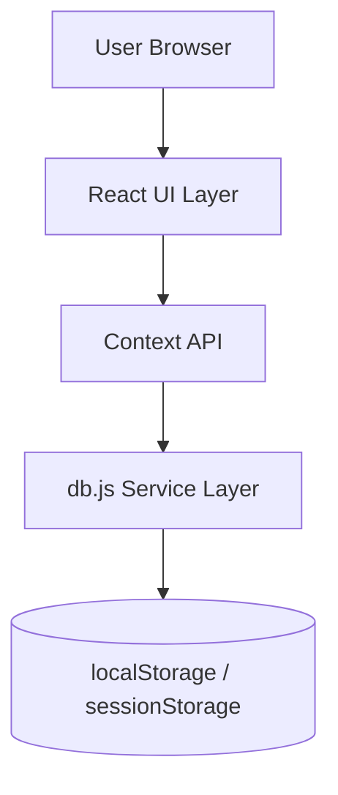
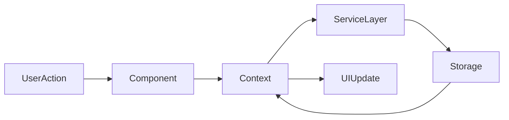
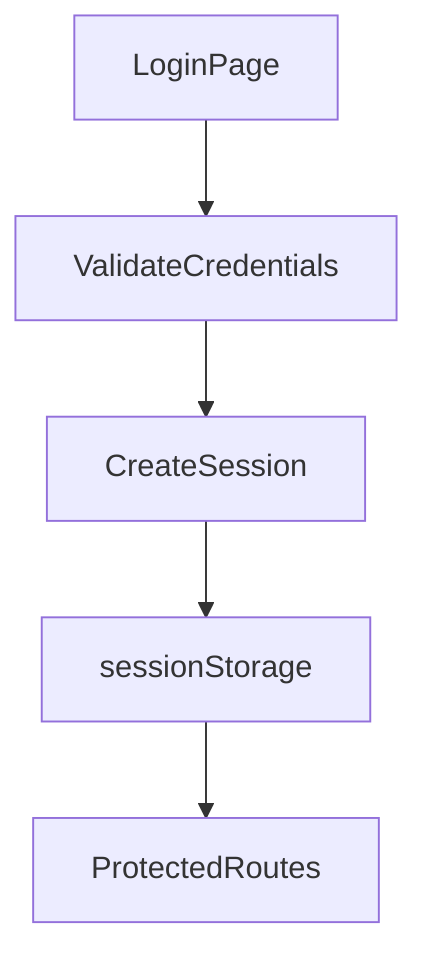
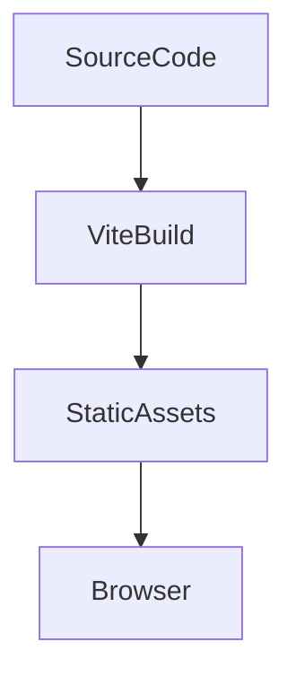

# System Architecture Document (SAD)

## Project Name

Mustakleen Platform

---

# 1. Introduction

## 1.1 Purpose

This document defines the architecture of the Mustakleen platform.

The SAD explains:

* system structure
* component interactions
* frontend architecture
* state management
* persistence mechanisms
* scalability considerations
* technical risks

This document supports:

* onboarding
* maintenance
* QA preparation
* future scalability
* backend migration planning

---

## 1.2 Scope

The document covers:

* frontend architecture
* storage architecture
* React component organization
* authentication flow
* state management
* data persistence
* deployment assumptions
* architectural risks

---

# 2. Architectural Overview

Mustakleen is a:

* frontend-only
* React-based
* Single Page Application (SPA)

The architecture relies on:

* React components
* Context API state management
* localStorage persistence
* sessionStorage session management
* role-based routing

---

# 3. High-Level Architecture



---

# 4. Architectural Style

| Area             | Style                        |
| ---------------- | ---------------------------- |
| Frontend         | Component-Based Architecture |
| Navigation       | SPA Routing                  |
| State Management | Context-Based State          |
| Persistence      | Client-side Storage          |
| Data Flow        | Unidirectional UI Flow       |

---

# 5. Frontend Architecture

The frontend architecture is organized around:

* reusable React components
* pages
* contexts
* utility services
* route guards

---

## Main Frontend Layers

| Layer      | Responsibility          |
| ---------- | ----------------------- |
| Pages      | User-facing screens     |
| Components | Reusable UI elements    |
| Contexts   | Global state management |
| Services   | Data operations         |
| Utils      | Shared helper functions |

---

# 6. State Management Architecture

The platform uses:

* React Context API
* local component state
* sessionStorage persistence

---

## Main Contexts

| Context         | Responsibility       |
| --------------- | -------------------- |
| AuthContext     | Authentication state |
| LanguageContext | Localization state   |

---

## State Flow



---

# 7. Authentication Architecture

Authentication is currently:

* client-side
* session-based
* role-driven

---

## Authentication Flow



---

## Authentication Risks

| Risk                       | Impact                    |
| -------------------------- | ------------------------- |
| Client-side auth           | Security exposure         |
| sessionStorage corruption  | Invalid sessions          |
| Missing backend validation | Unauthorized access risks |

---

# 8. Persistence Architecture

The platform stores data using:

* localStorage
* sessionStorage

---

## Storage Responsibilities

| Storage        | Purpose                   |
| -------------- | ------------------------- |
| localStorage   | Business data persistence |
| sessionStorage | Session persistence       |

---

## Persistence Risks

| Risk               | Impact              |
| ------------------ | ------------------- |
| Storage corruption | Data inconsistency  |
| Quota limitations  | Persistence failure |
| Manual tampering   | Invalid states      |

---

# 9. Routing Architecture

The application uses:

* React Router
* protected routes
* role-based access control

---

## Route Categories

| Route Type           | Access              |
| -------------------- | ------------------- |
| Public Routes        | Everyone            |
| Authenticated Routes | Logged-in users     |
| Admin Routes         | Administrators only |
| Company Routes       | Company users only  |

---

# 10. Component Architecture

The component structure follows:

* reusable component design
* modular page organization
* shared UI patterns

---

## Major Component Types

| Component Type       | Responsibility          |
| -------------------- | ----------------------- |
| Layout Components    | Shared layout structure |
| Feature Components   | Business functionality  |
| Modal Components     | Dialog workflows        |
| Dashboard Components | Analytics & management  |

---

# 11. Service Layer Architecture

The service layer is primarily implemented in:

```text id="v95w84"
db.js
```

Responsibilities include:

* data persistence
* CRUD operations
* discount management
* analytics calculations
* session operations

---

## Architectural Risk

The service layer currently represents:

* a centralized dependency
* potential scalability bottleneck
* maintainability risk

---

# 12. Localization Architecture

Localization is implemented using:

* LanguageContext
* dynamic translations
* document direction switching

---

## Supported Features

* Arabic
* English
* RTL/LTR layouts

---

# 13. Error Handling Architecture

Current architecture partially supports:

* validation handling
* authorization redirects
* controlled failures

---

## Missing Improvements

Recommended:

* Global ErrorBoundary
* Centralized logging
* Telemetry integration

---

# 14. Deployment Architecture

Current deployment assumptions:

* local development environment
* frontend static hosting
* browser runtime execution

---

## Deployment Flow



---

# 15. Scalability Considerations

Future scalability improvements may include:

* backend APIs
* server-side authentication
* cloud storage
* CI/CD integration
* modular services
* observability tooling

---

# 16. Technical Risks

| Risk                       | Severity |
| -------------------------- | -------- |
| Client-side authentication | Critical |
| Centralized db.js          | High     |
| Missing observability      | High     |
| localStorage limitations   | High     |
| Missing backend APIs       | Critical |

---

# 17. QA Impact

The architecture directly impacts:

* testability
* automation stability
* session testing
* persistence validation
* role-based testing
* UI state testing

---

# 18. Conclusion

The Mustakleen platform architecture provides:

* modular frontend organization
* role-based workflows
* client-side persistence
* scalable documentation structure

The architecture also highlights:

* technical limitations
* future scalability opportunities
* QA risk areas
* production-readiness gaps

This document forms the architectural foundation for:

* future development
* QA execution
* backend migration
* maintainability planning
