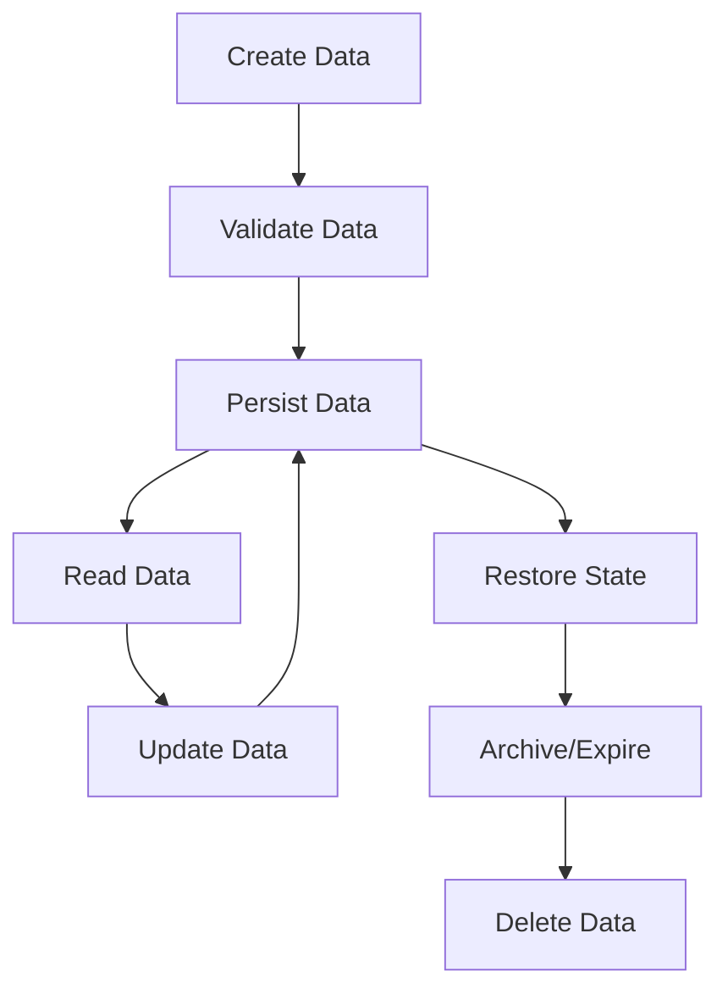
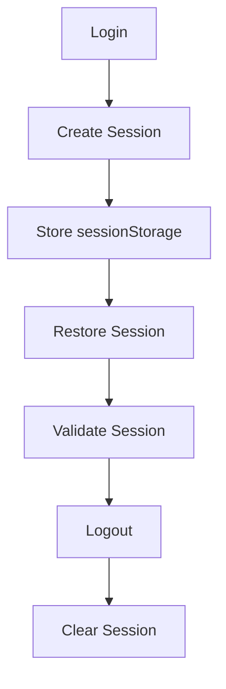
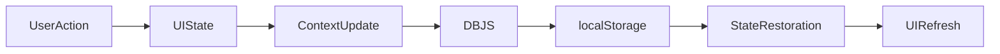

# Data Lifecycle Documentation

## Project Name

Mustakleen Platform

---

# 1. Introduction

This document defines the lifecycle of business and session data within the Mustakleen platform.

The purpose is to explain:

* how data is created
* how data is updated
* how data is persisted
* how data is restored
* how data is archived or removed

This document supports:

* QA validation
* persistence tracing
* debugging
* architecture understanding
* future backend migration planning

---

# 2. Data Lifecycle Overview

---

# 3. User Data Lifecycle

---

## Creation Phase

### Trigger

User registration.

### Operations

* Validate registration data.
* Create user entity.
* Persist user in localStorage.
* Initialize loyalty points.
* Initialize authenticated session.

---

## Update Phase

### Trigger

* profile updates
* loyalty updates
* installment updates

### Operations

* update user object
* synchronize UI state
* persist modified data

---

## Restoration Phase

### Trigger

Browser refresh or app restart.

### Operations

* restore user session
* restore UI state
* re-render dashboards

---

## Deletion Phase

### Trigger

Logout or manual cleanup.

### Operations

* clear session
* optionally clear persisted data

---

# 4. Discount Data Lifecycle

---

## Creation Phase

### Trigger

Company creates offer.

### Operations

* validate offer
* assign pending status
* persist discount

---

## Moderation Phase

### Trigger

Admin review.

### Operations

* approve or reject discount
* update visibility state
* persist moderation result

---

## Redemption Phase

### Trigger

User redeems discount.

### Operations

* generate promo code
* create invoice
* create redemption record
* update loyalty points

---

## Expiration Phase

### Trigger

Discount endDate reached.

### Operations

* mark discount expired
* remove from visible marketplace

---

# 5. Session Lifecycle

---

# 6. Installment Data Lifecycle

---

## Creation Phase

### Trigger

Installment enrollment.

### Operations

* create installment schedule
* calculate balances
* persist installment records

---

## Update Phase

### Trigger

Payment submission.

### Operations

* update installment status
* recalculate remaining balance
* refresh dashboard state

---

## Archive Phase

### Trigger

All installments paid.

### Operations

* mark installment archived
* retain payment history

---

# 7. Localization Data Lifecycle

---

## Creation Phase

### Trigger

Language selection.

### Operations

* update LanguageContext
* persist selected language
* update document direction

---

## Restoration Phase

### Trigger

Application reload.

### Operations

* restore saved language
* restore RTL/LTR rendering

---

# 8. Data Synchronization Lifecycle

---

# 9. Data Integrity Risks

| Risk                   | Impact                    |
| ---------------------- | ------------------------- |
| Corrupted localStorage | Invalid application state |
| Missing validation     | Invalid persistence       |
| Shared state mutations | UI inconsistency          |
| Duplicate records      | Business inconsistency    |
| Manual tampering       | Security exposure         |

---

# 10. Persistence Failure Scenarios

| Scenario              | Expected Handling   |
| --------------------- | ------------------- |
| Invalid JSON          | Safe recovery       |
| Missing session       | Redirect to login   |
| Corrupted storage     | Reset invalid data  |
| Duplicate persistence | Prevent duplication |

---

# 11. QA Validation Areas

QA should validate:

* data creation
* persistence updates
* state restoration
* session cleanup
* expiration handling
* duplicate prevention
* corrupted storage recovery

---

# 12. Future Backend Lifecycle Vision

Future backend architecture may include:

* transactional persistence
* audit logs
* soft deletes
* database triggers
* versioned records
* distributed persistence

---

# 13. Recommended Improvements

* Add persistence abstraction layer
* Add schema validation
* Add storage recovery utilities
* Add audit logging
* Add backend lifecycle management

---

# 14. QA Impact

The data lifecycle directly impacts:

* regression testing
* persistence validation
* state restoration testing
* session testing
* data integrity testing

---

# 15. Conclusion

The data lifecycle documentation defines how information moves, changes, persists, and expires within the Mustakleen platform.

It provides visibility into:

* data state transitions
* persistence workflows
* session behavior
* synchronization flow
* QA validation requirements
