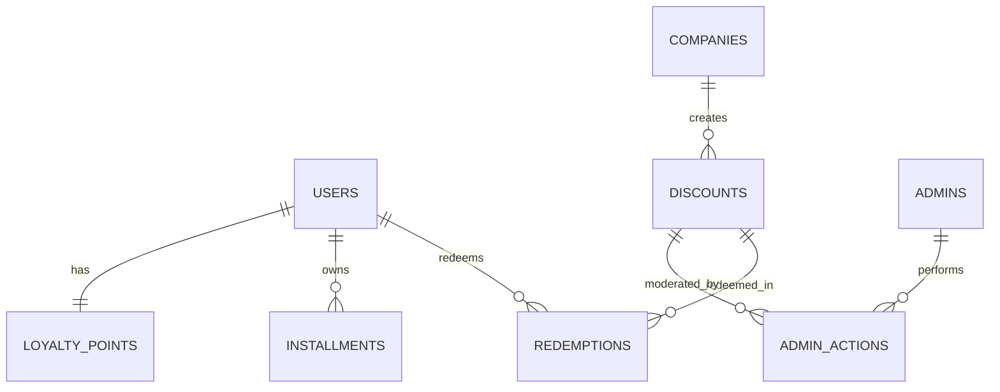

# Entity Relationship Diagram (ERD)

## Project Name

Mustakleen Platform

---

# 1. Introduction

This document defines the logical Entity Relationship Diagram (ERD) for the Mustakleen platform.

Although the current implementation uses:

* localStorage
* frontend persistence

the system still contains logical entities and relationships equivalent to a traditional database model.

This document supports:

* QA understanding
* backend migration planning
* persistence tracing
* data validation
* future API design

---

# 2. Main Entities

| Entity        | Description                 |
| ------------- | --------------------------- |
| Users         | Platform users              |
| Companies     | Business accounts           |
| Discounts     | Service offers              |
| Redemptions   | Discount redemption records |
| Installments  | Installment payment records |
| LoyaltyPoints | User loyalty tracking       |
| AdminActions  | Moderation actions          |
| Sessions      | Authentication sessions     |

---

# 3. High-Level ERD

---

# 4. Entity Definitions

---

# 4.1 USERS

## Description

Represents authenticated platform users.

## Main Attributes

| Attribute     | Type     |
| ------------- | -------- |
| id            | UUID     |
| name          | String   |
| email         | String   |
| password      | String   |
| role          | Enum     |
| governorate   | String   |
| loyaltyPoints | Number   |
| createdAt     | DateTime |

---

# 4.2 COMPANIES

## Description

Represents business entities that publish discounts.

## Main Attributes

| Attribute   | Type     |
| ----------- | -------- |
| id          | UUID     |
| companyName | String   |
| email       | String   |
| category    | String   |
| createdAt   | DateTime |

---

# 4.3 DISCOUNTS

## Description

Represents published service offers and discounts.

## Main Attributes

| Attribute     | Type     |
| ------------- | -------- |
| id            | UUID     |
| title         | String   |
| description   | String   |
| category      | String   |
| discountValue | Number   |
| startDate     | Date     |
| endDate       | Date     |
| status        | Enum     |
| companyId     | UUID     |
| approvedAt    | DateTime |

---

# 4.4 REDEMPTIONS

## Description

Tracks discount redemption activity.

## Main Attributes

| Attribute  | Type     |
| ---------- | -------- |
| id         | UUID     |
| userId     | UUID     |
| discountId | UUID     |
| promoCode  | String   |
| redeemedAt | DateTime |
| invoiceId  | UUID     |

---

# 4.5 INSTALLMENTS

## Description

Tracks installment payment schedules.

## Main Attributes

| Attribute         | Type   |
| ----------------- | ------ |
| id                | UUID   |
| userId            | UUID   |
| totalAmount       | Number |
| remainingAmount   | Number |
| installmentStatus | Enum   |
| dueDate           | Date   |

---

# 4.6 LOYALTY_POINTS

## Description

Tracks accumulated loyalty points for users.

## Main Attributes

| Attribute   | Type     |
| ----------- | -------- |
| id          | UUID     |
| userId      | UUID     |
| totalPoints | Number   |
| updatedAt   | DateTime |

---

# 4.7 ADMIN_ACTIONS

## Description

Tracks moderation activities performed by administrators.

## Main Attributes

| Attribute  | Type     |
| ---------- | -------- |
| id         | UUID     |
| adminId    | UUID     |
| discountId | UUID     |
| actionType | Enum     |
| actionDate | DateTime |

---

# 4.8 SESSIONS

## Description

Represents active authenticated sessions.

## Main Attributes

| Attribute    | Type     |
| ------------ | -------- |
| id           | UUID     |
| userId       | UUID     |
| sessionToken | String   |
| createdAt    | DateTime |
| expiresAt    | DateTime |

---

# 5. Relationship Definitions

| Relationship           | Type        |
| ---------------------- | ----------- |
| User → Redemptions     | One-to-Many |
| User → Installments    | One-to-Many |
| User → LoyaltyPoints   | One-to-One  |
| Company → Discounts    | One-to-Many |
| Discount → Redemptions | One-to-Many |
| Admin → AdminActions   | One-to-Many |

---

# 6. Logical Persistence Mapping

| Entity        | Current Storage |
| ------------- | --------------- |
| Users         | localStorage    |
| Discounts     | localStorage    |
| Installments  | localStorage    |
| LoyaltyPoints | localStorage    |
| Sessions      | sessionStorage  |

---

# 7. Data Integrity Risks

| Risk                           | Impact                 |
| ------------------------------ | ---------------------- |
| Missing foreign key validation | Inconsistent relations |
| localStorage corruption        | Data inconsistency     |
| Manual tampering               | Invalid states         |
| No transactional integrity     | Partial updates        |

---

# 8. Future Database Vision

Future backend migration may include:

* PostgreSQL
* MongoDB
* Prisma ORM
* Server-side relationships
* Database constraints
* Transaction support

---

# 9. QA Impact

The ERD supports:

* data validation testing
* relationship testing
* persistence tracing
* API planning
* backend migration preparation

---

# 10. Conclusion

The ERD defines the logical data structure of the Mustakleen platform and provides visibility into:

* entity relationships
* persistence structure
* business data organization
* future backend scalability
