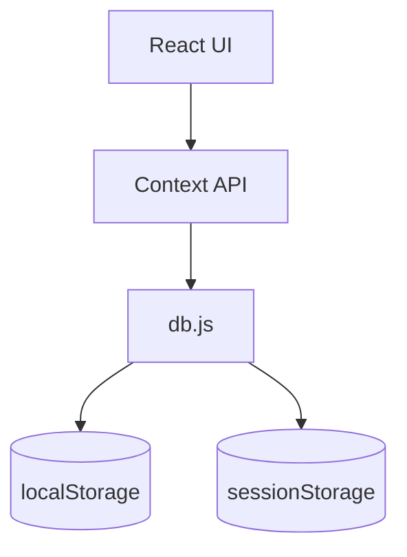
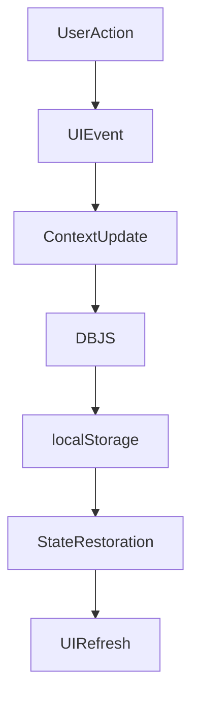
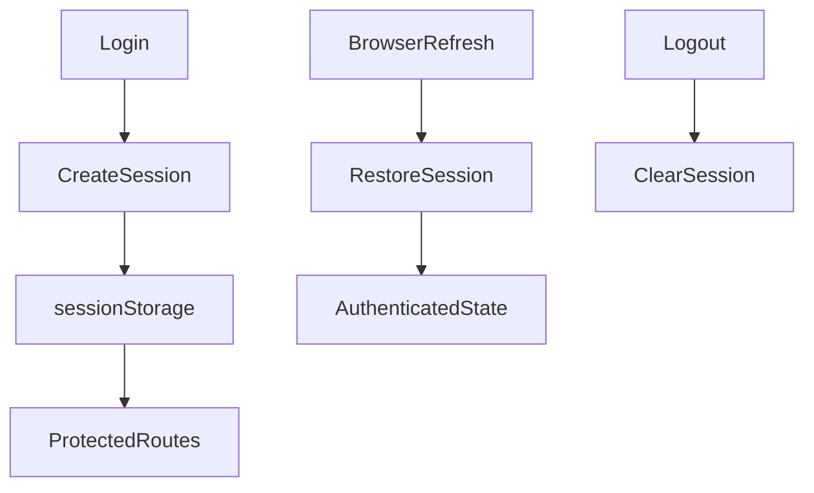

# Persistence Strategy

## Project Name

Mustakleen Platform

---

# 1. Introduction

This document defines the persistence strategy used within the Mustakleen platform.

The platform currently relies on:

* localStorage
* sessionStorage

instead of traditional backend databases.

This document explains:

* persistence behavior
* storage responsibilities
* session lifecycle
* data synchronization
* storage risks

This document supports:

* QA validation
* debugging
* architecture analysis
* future backend migration planning

---

# 2. Persistence Architecture Overview

---

# 3. Storage Mechanisms

| Storage Type   | Purpose                            |
| -------------- | ---------------------------------- |
| localStorage   | Business data persistence          |
| sessionStorage | Authentication session persistence |

---

# 4. localStorage Persistence Strategy

---

## Responsibilities

localStorage stores:

* users
* discounts
* installments
* loyalty points
* localization preferences
* redemption records

---

## Characteristics

| Characteristic | Description              |
| -------------- | ------------------------ |
| Persistence    | Survives browser refresh |
| Scope          | Browser-wide             |
| Capacity       | Limited quota            |
| Security       | Client-accessible        |

---

## Risks

| Risk                 | Impact              |
| -------------------- | ------------------- |
| Manual tampering     | Invalid states      |
| Corruption           | Broken workflows    |
| Quota exceeded       | Persistence failure |
| Shared browser usage | Data leakage        |

---

# 5. sessionStorage Persistence Strategy

---

## Responsibilities

sessionStorage stores:

* authenticated session
* current user state
* temporary runtime session data

---

## Characteristics

| Characteristic | Description                |
| -------------- | -------------------------- |
| Persistence    | Per browser tab/session    |
| Scope          | Session-only               |
| Auto-clear     | Clears after browser close |
| Security       | Client-accessible          |

---

## Risks

| Risk                | Impact             |
| ------------------- | ------------------ |
| Session corruption  | Unauthorized state |
| Browser close       | Session loss       |
| Client manipulation | Security issues    |

---

# 6. Data Persistence Lifecycle

---

# 7. Session Lifecycle

---

# 8. Synchronization Strategy

The application synchronizes state using:

* React Context API
* storage restoration
* component re-rendering
* shared service updates

---

## Synchronization Risks

| Risk                  | Impact              |
| --------------------- | ------------------- |
| Shared mutations      | Inconsistent UI     |
| Stale restoration     | Incorrect rendering |
| Async race conditions | State mismatch      |

---

# 9. Persistence Validation Rules

| Validation Area   | Expected Behavior                |
| ----------------- | -------------------------------- |
| Session restore   | Valid sessions restore correctly |
| Invalid session   | Redirect to login                |
| Corrupted storage | Safe recovery behavior           |
| Duplicate records | Prevent invalid duplication      |

---

# 10. Persistence Error Handling

| Failure Scenario       | Expected Handling     |
| ---------------------- | --------------------- |
| Corrupted localStorage | Reset invalid data    |
| Missing session        | Redirect to login     |
| Invalid JSON parsing   | Fail gracefully       |
| Storage quota exceeded | Show warning/fallback |

---

# 11. QA Validation Areas

QA should validate:

* localStorage persistence
* session restoration
* corrupted storage handling
* logout cleanup
* stale state behavior
* duplicate persistence issues
* browser refresh behavior

---

# 12. Current Architectural Limitations

| Limitation                 | Impact                   |
| -------------------------- | ------------------------ |
| No centralized database    | No shared persistence    |
| Client-side storage only   | Security exposure        |
| No transactional integrity | Partial updates possible |
| No backend validation      | Invalid persistence risk |

---

# 13. Future Persistence Vision

Future persistence improvements may include:

* PostgreSQL
* MongoDB
* Redis session storage
* backend APIs
* ORM validation
* transactional operations

---

# 14. Recommended Improvements

* Add storage validation layer
* Add schema validation
* Add storage recovery utilities
* Add centralized persistence abstraction
* Add audit logging

---

# 15. QA Impact

The persistence strategy directly affects:

* session testing
* state validation
* regression testing
* security testing
* automation reliability

---

# 16. Conclusion

The persistence strategy defines how the Mustakleen platform stores and restores application state using browser storage mechanisms.

It provides visibility into:

* session lifecycle
* business data persistence
* synchronization behavior
* architectural risks
* QA validation requirements
