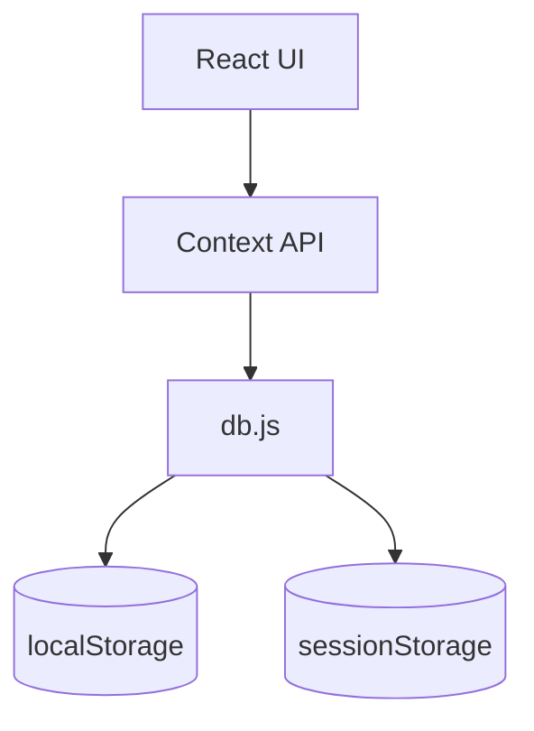
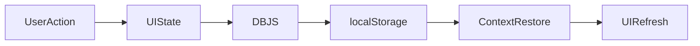

# Storage Schema Documentation

## Project Name

Mustakleen Platform

---

# 1. Introduction

This document defines the browser storage schema used within the Mustakleen platform.

The application currently relies on:

* localStorage
* sessionStorage

for persistence instead of a centralized backend database.

This document describes:

* storage keys
* stored structures
* data organization
* persistence responsibilities
* synchronization behavior

This document supports:

* QA validation
* debugging
* browser inspection
* persistence tracing
* future backend migration

---

# 2. Storage Architecture Overview



---

# 3. localStorage Schema

---

## 3.1 users

### Description

Stores registered platform users.

### Example Structure

```json id="7xwqk3"
[
  {
    "id": "uuid",
    "name": "Ahmed",
    "email": "ahmed@example.com",
    "role": "user",
    "governorate": "Cairo",
    "loyaltyPoints": 120
  }
]
```

---

## 3.2 discounts

### Description

Stores platform discount offers.

### Example Structure

```json id="6pv4mz"
[
  {
    "id": "uuid",
    "title": "Medical Discount",
    "category": "Healthcare",
    "discountValue": 25,
    "status": "approved",
    "companyId": "company_uuid"
  }
]
```

---

## 3.3 redemptions

### Description

Stores discount redemption history.

### Example Structure

```json id="m4z8xp"
[
  {
    "id": "uuid",
    "userId": "user_uuid",
    "discountId": "discount_uuid",
    "promoCode": "PROMO123"
  }
]
```

---

## 3.4 installments

### Description

Stores installment payment schedules.

### Example Structure

```json id="q2v9rt"
[
  {
    "id": "uuid",
    "userId": "user_uuid",
    "totalAmount": 5000,
    "remainingAmount": 2000,
    "installmentStatus": "processing"
  }
]
```

---

## 3.5 loyaltyPoints

### Description

Stores user loyalty point balances.

### Example Structure

```json id="t6m3qp"
[
  {
    "userId": "user_uuid",
    "totalPoints": 450
  }
]
```

---

## 3.6 localization

### Description

Stores selected UI language.

### Example Structure

```json id="j8v2mn"
{
  "language": "ar",
  "direction": "rtl"
}
```

---

# 4. sessionStorage Schema

---

## 4.1 authenticatedSession

### Description

Stores active authenticated user session.

### Example Structure

```json id="v3x8qt"
{
  "userId": "uuid",
  "role": "user",
  "sessionToken": "session_token"
}
```

---

# 5. Storage Key Responsibilities

| Storage Key          | Responsibility             |
| -------------------- | -------------------------- |
| users                | Persist user accounts      |
| discounts            | Persist offers             |
| redemptions          | Persist redemption history |
| installments         | Persist installment states |
| loyaltyPoints        | Persist loyalty balances   |
| localization         | Persist language settings  |
| authenticatedSession | Persist active session     |

---

# 6. Storage Synchronization Flow



---

# 7. Storage Validation Rules

| Area         | Validation               |
| ------------ | ------------------------ |
| users        | Unique emails            |
| discounts    | Valid status enums       |
| installments | Non-negative balances    |
| sessions     | Valid role assignment    |
| localization | Supported languages only |

---

# 8. Storage Risks

| Risk               | Impact              |
| ------------------ | ------------------- |
| Manual tampering   | Invalid states      |
| Storage corruption | Broken rendering    |
| Invalid JSON       | Parsing failures    |
| Shared mutations   | Data inconsistency  |
| Missing validation | Invalid persistence |

---

# 9. Browser Storage Limitations

| Limitation              | Impact                  |
| ----------------------- | ----------------------- |
| Storage quota           | Limited persistence     |
| Client accessibility    | Security exposure       |
| No relational integrity | Inconsistent references |
| No transactions         | Partial updates         |

---

# 10. QA Validation Areas

QA should validate:

* storage persistence
* session restoration
* corrupted JSON handling
* invalid enum handling
* duplicate data prevention
* storage cleanup after logout

---

# 11. Recommended Improvements

* Add schema validation layer
* Add persistence abstraction layer
* Add storage recovery utilities
* Add centralized storage manager
* Add encryption for sensitive data

---

# 12. Future Backend Migration Considerations

Future backend architecture may replace browser storage with:

* PostgreSQL
* MongoDB
* Redis
* secure authentication sessions
* API-driven persistence

---

# 13. Conclusion

The storage schema defines the structure and organization of persisted browser data within the Mustakleen platform.

It provides visibility into:

* storage organization
* persistence structure
* session lifecycle
* data synchronization
* QA validation requirements
